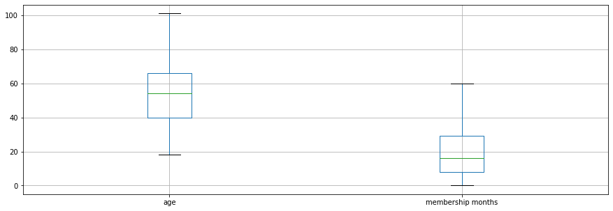
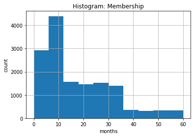
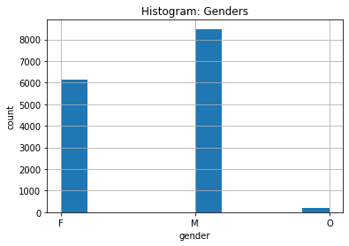
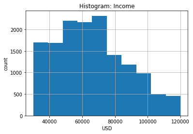
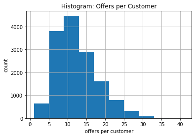
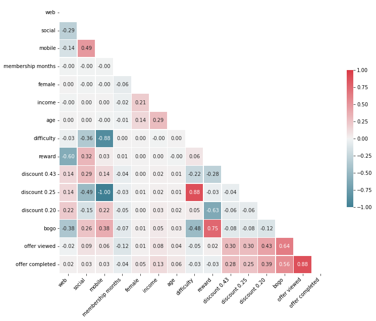
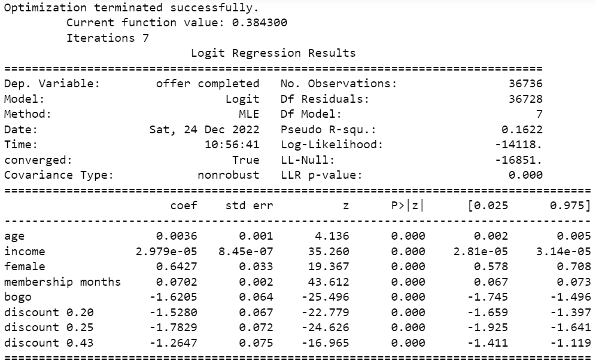
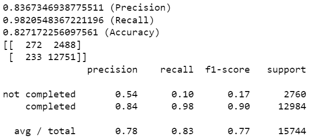

# Udacity Data Scientist Capstone: Starbucks

## Table of Contents
1. [Project Overview](#overview)
2. [Strategy](#strategy)
3. [Analysis](#analysis)
4. [Methdology](#methodology)
5. [Results](#results)
6. [Conclusion](#conclusion)

Addendum: [Rules Export](#export_rules)

## Project Overview <a name="overview"></a>

### Motivation

This is the summary of the capstone project for the Udacity Data Scientist Nanodegree program. I have chosen the Starbucks project to provide insights on customer behavior by analyzing offers, demographic and transaction data.

### Problem Statement

- Transform the dataset into a form that is suited for further analysis and processing
- Identify features that have are statistically significant in predicting whether a user will complete an offer or not
- Predict whether a given customer will react to offers that have been sent or not

### Metrics

To evaluate the model performance, we will look at different metrics:

- runtime
- accuracy
- precision
- recall
- f1 score
- confusion matrix


### Key Findings

- Investigate replacing all 25% discounts with 20% discounts since those have a similar completion rate but are cheaper for the company, increasing the margins.
- Some customers have received a large number of offers, very few even more than one offer per day. This should be optimized as a) customers might get annoyed and b) customers will not buy at regular prices anymore (behavioral), thus decreasing margins.
- Out of a list of evaluated classifiers, the DecisionTreeClassifier with default settings has been found to be the best choice. Especially due to its comparatively high recall on 'not completed' offers.


### Overview of Dataset (as provided)

The program used to create the data simulates how people make purchasing decisions and how those decisions are influenced by promotional offers.

Each person in the simulation has some hidden traits that influence their purchasing patterns and are associated with their observable traits. People produce various events, including receiving offers, opening offers, and making purchases.
As a simplification, there are no explicit products to track. Only the amounts of each transaction or offer are recorded.

There are three types of offers that can be sent: buy-one-get-one (BOGO), discount, and informational. In a BOGO offer, a user needs to spend a certain amount to get a reward equal to that threshold amount. In a discount, a user gains a reward equal to a fraction of the amount spent. In an informational offer, there is no reward, but neither is there a requisite amount that the user is expected to spend. Offers can be delivered via multiple channels.

The data is contained in three files:

- portfolio.json - containing offer ids and meta data about each offer (duration, type, etc.)
- profile.json - demographic data for each customer
- transcript.json - records for transactions, offers received, offers viewed, and offers completed

#### profile.json

Rewards program users (17000 users x 5 fields)

- gender: (categorical) M, F, O, or null
- age: (numeric) missing value encoded as 118
- id: (string/hash)
- became\_member\_on: (date) format YYYYMMDD
- income: (numeric)

#### portfolio.json

Offers sent during 30-day test period (10 offers x 6 fields)

- reward: (numeric) money awarded for the amount spent
- channels: (list) web, email, mobile, social
- difficulty: (numeric) money required to be spent to receive reward
- duration: (numeric) time for offer to be open, in days
- offer_type: (string) bogo, discount, informational
- id: (string/hash)

#### transcript.json

Event log (306648 events x 4 fields)

- person: (string/hash)
- event: (string) offer received, offer viewed, transaction, offer completed
- value: (dictionary) different values depending on event type
    - offer id: (string/hash) not associated with any "transaction"
    - amount: (numeric) money spent in "transaction"
    - reward: (numeric) money gained from "offer completed"
- time: (numeric) hours after start of test

## Strategy <a name="strategy"></a>

Following CRISP-DM first business and data understanding is generated by exploring the data beyond the information provided in the dataset description. Subsequently the data is cleaned and prepared for the final modelling. Finally the models are scored.


## Analysis <a name="analysis"></a>

### Data Exploration

The experiment is run for about 30 days.

#### Portfolio

There are 10 different offer types in the dataset.

Except for the bogo offer (100% discount), there are discounts of 20%, 25% and 43% (if maxed out by just fulfilling the difficulty). Informational offer has 0% discount.

#### Profile

There is a number of customers without valid entries for age, gender and income. These are removed from the dataset, leaving 14825 customers with proper data.

The boxplots visualize the age and membership distributions. (Note: age in years, membership in months)


As there is no date specified, is is assumed that the test was run roughly a week after the data has been acquired. This yields the folllowing more detailed distribution of **membership** durations in months:


The **gender** distribution of the left customers is as follows:

57% of the users being male, 41% female and 1% others. Due to the under-represantation 'others' are dropped. This may have Ethical implications which are not discussed here.

For the left users the **income** distribution is slightly skewed towards lower incomes:


#### Transcript

There are transactions of more than 1000 USD in the dataset. However, 99.5% of all transactions are below 52 USD.

A quick check for the suspected correlation between age and income yields following graph:

If this pattern with these steps is not due to random data point generation, this is definitely something to look into for future experiments to ensure the quality of the data. For here we accept it as it is and will look at collinearity below.

### Findings from Data Analysis

- 99% of the offers in the reduced dataset are viewed by the customers
- about 80% of all offers are completed by the customers, if not accounting for informational offers.
    The different offer types have about the same completion rates. 25% discount has the lowest completion rate, lower than 20% discounts - which is 'cheaper' for the company. Thus an A/B test for dropping the 25% discount is suggested, if further analysis shows that demographic subgroups show similar results (Simpson's Paradox!). Not investigated here.

| offer type | total completed offers | relative completed offers |
| --- | --- | --- |
| bogo | 21523 | 82.2% |
| discount_43% | 5658 | 86.2% |
| discount_25% | 5290 | 79.8% |
| discount_20% | 10938 | 83.4% |

- Some customers have received a large number of offers, very few even more than one offer per day. This should be optimized as a) customers might get annoyed and b) customers will not buy at regular prices anymore (behavioral), thus decreasing margins.
    

#### Correlations


The correlation analysis does not yield major insights. For example, there is a strong correlation between 'offer viewed' and 'offer completed', which is not very surprising. This is rather a step towards modeling by identifying feature collinearity. For example, not surprisingly, there is a correlation between the absolute offer features 'reward' and 'difficulty' and the relative ones.

## Methodology <a name="methodology"></a>
### Data Preprocessing

The data has been found to be rather complete (not many null values) and with few outliers.
The main preprocessing steps included dropping rows with rows that do not contain information in any of the columns 'age' (originally encoded as *118*), 'gender' and 'income'. 

To be able to process the numerous categorical variables, these were one-hot encoded and both the original column and - in most cases - one of the generated columns were dropped (k-1).

### Implementation
For a first evalutation logistic regression classifiers from the packages `statsmodels` and `sklearn` are trained. The advantag of the statsmodels classifier lies in its extended models summary, whereas the sklearn model can be compared to other algorithms in that package with relative ease. 
Before training the classifiers the collinearity of different feature sets is evaluated using variance inflation factors (VIF).

### Refinement
After having decided on a feature set, a set of different classifiers is trained, scored and compared. As a result a classifier is chosen and grid search is used to tune hyperparameters. However, it was found that the tuned model has poor recall for the class of 'not completed' offers. Thus the tuned model is dropped in favor of the chosen model with default parameters.

## Results <a name="results"></a>

Classification models are set up to help determine whether a user will **complete an offer**, or not. Different feature sets and models are analyzed.

```python
y = df['offer completed']
```

### Model Evaluation and Validation
#### Feature Engineering

4 different sets of features are evaluated:

```python
X_all = df[['age', 'income', 'female', 'membership months', 'reward', 'difficulty', 'bogo', 'discount 0.20', 'discount 0.25', 'discount 0.43']]
X_rel = df[['age', 'income', 'female', 'membership months', 'bogo', 'discount 0.20', 'discount 0.25', 'discount 0.43']]
X_abs = df[['age', 'income', 'female', 'membership months', 'reward', 'difficulty']]
X_demo =  df[['age', 'income', 'female', 'membership months']]
```

#### Multicollinearity: Variance Inflation Factors

```
X_all        feature        VIF
0                age   1.113177
1             income   1.147413
2             female   1.064623
3  membership months   1.000954
4             reward        inf
5         difficulty        inf
6               bogo  17.886203
7      discount 0.20        inf
8      discount 0.25        inf
9      discount 0.43        inf

X_rel        feature       VIF
0                age  1.113147
1             income  1.147385
2             female  1.064622
3  membership months  1.000945
4               bogo  8.881590
5      discount 0.20  4.942397
6      discount 0.25  2.992615
7      discount 0.43  2.961348

X_abs        feature       VIF
0                age  9.326740
1             income  9.461316
2             female  1.827985
3  membership months  2.367720
4             reward  3.657212
5         difficulty  4.703589

X_demo       feature       VIF
0                age  8.195107
1             income  8.531994
2             female  1.827984
3  membership months  2.303266
```

X_all has, as expected, too strong collinearity to be used for further modelling. We will test the other feature sets.

#### Statsmodels Logistic Regression

The statsmodels logistic regression is applied because statsmodels provides insights on feature relevance and coefficients.

For `X_rel` we get the following output:



The p values for all the features are 0 und therefore statistically significant. None of the features should be dropped. The table below shows the results, including the transformed coefficients (`np.exp()`) in column 'real coefficient'

<div>

|     | coef | std err | z   | P>\|z\| | \[0.025 | 0.975\] | real coeff |
| --- | --- | --- | --- | --- | --- | --- | --- |
| age | 0.00360 | 1.000000e-03 | 4.136 | 0.0 | 0.002000 | 0.005000 | 1.003606 |
| income | 0.00003 | 8.450000e-07 | 35.260 | 0.0 | 0.000028 | 0.000031 | 1.000030 |
| female | 0.64270 | 3.300000e-02 | 19.367 | 0.0 | 0.578000 | 0.708000 | 1.901608 |
| membership months | 0.07020 | 2.000000e-03 | 43.612 | 0.0 | 0.067000 | 0.073000 | 1.072723 |
| bogo | -1.62050 | 6.400000e-02 | -25.496 | 0.0 | -1.745000 | -1.496000 | 0.197800 |
| discount 0.20 | -1.52800 | 6.700000e-02 | -22.779 | 0.0 | -1.659000 | -1.397000 | 0.216969 |
| discount 0.25 | -1.78290 | 7.200000e-02 | -24.626 | 0.0 | -1.925000 | -1.641000 | 0.168150 |
| discount 0.43 | -1.26470 | 7.500000e-02 | -16.965 | 0.0 | -1.411000 | -1.119000 | 0.282324 |

</div>

#### sklearn

##### Feature Comparisons

A pipeline has been created for scaling features and defining the classifier to be used.

Again, we loop over the different feature sets. The metrics are very similar for the sets. We choose `X_rel` as a rather intuitive set to continue with comparing different classifiers.

##### Justification (Model Comparisons)

The following models are trained and a number of metrics are compared.

**models**

- LogisticRegression()
- SVC()
- KNeighborsClassifier()
- DecisionTreeClassifier()
- RandomForestClassifier()
- GradientBoostingClassifier()

**metrics**

- precision
- recall
- accuracy
- f1-score
- confusion matrix
- (runtime has not been measured, as it has been found to be short for all models)

One finding is the poor recall in some models (SVC, Logistic Regression, GradientBoostingClassifier) for 'not completed' vs. high recall for 'completed' of about 80% - given that the ratio of 'not completed' vs. 'completed' in the dataset is about 20% vs. 80%.

Due to the high and balanced scores we choose the DecisionTreeClassifier for further optimization:

```
DecisionTreeClassifier(class_weight=None, criterion='gini', max_depth=None,
            max_features=None, max_leaf_nodes=None,
            min_impurity_decrease=0.0, min_impurity_split=None,
            min_samples_leaf=1, min_samples_split=2,
            min_weight_fraction_leaf=0.0, presort=False, random_state=None,
            splitter='best')
0.965235489092731 (Precision)
0.9644177449168208 (Recall)
0.9420096544715447 (Accuracy)
[[ 2309   451]
 [  462 12522]]
 
               precision    recall  f1-score   support

not completed       0.83      0.84      0.83      2760
    completed       0.97      0.96      0.96     12984

  avg / total       0.94      0.94      0.94     15744
```

##### Optimization of DecisionTreeClassifier Model Using GridSearchCV

Using GridSearchCV the chosen model is optimized, finding the optimum parameters as:

```
DecisionTreeClassifier(class_weight=None, criterion='gini', max_depth=None,
            max_features=None, max_leaf_nodes=99,
            min_impurity_decrease=0.0, min_impurity_split=None,
            min_samples_leaf=1, min_samples_split=2,
            min_weight_fraction_leaf=0.0, presort=False, random_state=42,
            splitter='best')
```

However, when using these to predict and scoring the results, esp. recall on 'not completed' drops and the number of false positives and false negatives increases when comparing to the default parameters:

```
0.8532932083988783 (Precision)
0.9608749229821318 (Recall)
0.8314913617886179 (Accuracy)
[[  615  2145]
 [  508 12476]]
               precision    recall  f1-score   support

not completed       0.55      0.22      0.32      2760
    completed       0.85      0.96      0.90     12984

  avg / total       0.80      0.83      0.80     15744
```

Thus the DecisionTreeClassifier with default parameters is recommended for predicting, whether users will complete an offer or not.

exporting tree inspired by: https://stackoverflow.com/questions/20224526/how-to-extract-the-decision-rules-from-scikit-learn-decision-tree


## Conclusion <a name="conclusion"></a>
### Reflection
#### Expectations Towards Correlation Analysis and Statsmodels Summary
I was hoping to get better insights from a) an analysis of correlations and b) the summary of the statsmodels logistic regression classifier. 
Especially the comparison between the two evaluations is somewhat surprising: all the features were evaluated to be statistically significant when the correlation analysis would have suggested otherwise. It should be added that even though the statsmodels classifier converged, it was evaluated as 'not robust'.

#### Outdated Packages (Udacity workspace)
I struggled quite a bit with the very outdated which are installed in the udacity Jupyter workspace. Despite the description advising to use conda updates, this solution did not work. I was finally to update some packages using pip. Some of the packages could only be updated by uninstalling and reinstalling. This cost a lot of valuable time because:

1.  problem needs to be resolved when occuring for the first time
2.  at the start of each session the packages have to be (re)installed and upgraded (some have to be uninstalled before)
3.  this tedious process needed to be explained in README.

### Improvement
- even more models could be investigated
- more of the investigated models could be fine-tuned and compared again
- different feature selections could be tested
- different questions could be asked and answered using the provided dataset, e.g. which channels yield the most transactions. 


# Addendum
## Export of Rules of Final DecisionTreeClassifier <a name="export_rules"></a>

```
|--- membership months <= -0.39
|   |--- income <= 0.28
|   |   |--- female <= 0.16
|   |   |   |--- income <= -0.82
|   |   |   |   |--- membership months <= -0.90
|   |   |   |   |   |--- income <= -1.01
|   |   |   |   |   |   |--- discount 0.25 <= 1.13
|   |   |   |   |   |   |   |--- age <= -1.95
|   |   |   |   |   |   |   |   |--- membership months <= -1.19
|   |   |   |   |   |   |   |   |   |--- class: 1
|   |   |   |   |   |   |   |   |--- membership months >  -1.19
|   |   |   |   |   |   |   |   |   |--- income <= -1.15
|   |   |   |   |   |   |   |   |   |   |--- discount 0.20 <= 0.58
|   |   |   |   |   |   |   |   |   |   |   |--- truncated branch of depth 4
|   |   |   |   |   |   |   |   |   |   |--- discount 0.20 >  0.58
|   |   |   |   |   |   |   |   |   |   |   |--- truncated branch of depth 3
|   |   |   |   |   |   |   |   |   |--- income >  -1.15
|   |   |   |   |   |   |   |   |   |   |--- class: 1
|   |   |   |   |   |   |   |--- age >  -1.95
|   |   |   |   |   |   |   |   |--- age <= -1.43
|   |   |   |   |   |   |   |   |   |--- membership months <= -1.05
|   |   |   |   |   |   |   |   |   |   |--- income <= -1.52
|   |   |   |   |   |   |   |   |   |   |   |--- truncated branch of depth 4
|   |   |   |   |   |   |   |   |   |   |--- income >  -1.52
|   |   |   |   |   |   |   |   |   |   |   |--- truncated branch of depth 4
|   |   |   |   |   |   |   |   |   |--- membership months >  -1.05
|   |   |   |   |   |   |   |   |   |   |--- age <= -1.89
|   |   |   |   |   |   |   |   |   |   |   |--- class: 1
|   |   |   |   |   |   |   |   |   |   |--- age >  -1.89
|   |   |   |   |   |   |   |   |   |   |   |--- truncated branch of depth 7
|   |   |   |   |   |   |   |   |--- age >  -1.43
|   |   |   |   |   |   |   |   |   |--- income <= -1.06
|   |   |   |   |   |   |   |   |   |   |--- membership months <= -1.19
|   |   |   |   |   |   |   |   |   |   |   |--- truncated branch of depth 8
|   |   |   |   |   |   |   |   |   |   |--- membership months >  -1.19
|   |   |   |   |   |   |   |   |   |   |   |--- truncated branch of depth 19
|   |   |   |   |   |   |   |   |   |--- income >  -1.06
|   |   |   |   |   |   |   |   |   |   |--- age <= -1.20
|   |   |   |   |   |   |   |   |   |   |   |--- class: 1
|   |   |   |   |   |   |   |   |   |   |--- age >  -1.20
|   |   |   |   |   |   |   |   |   |   |   |--- truncated branch of depth 8
|   |   |   |   |   |   |--- discount 0.25 >  1.13
|   |   |   |   |   |   |   |--- membership months <= -1.12
|   |   |   |   |   |   |   |   |--- age <= 0.76
|   |   |   |   |   |   |   |   |   |--- age <= -2.03
|   |   |   |   |   |   |   |   |   |   |--- class: 1
|   |   |   |   |   |   |   |   |   |--- age >  -2.03
|   |   |   |   |   |   |   |   |   |   |--- age <= -0.22
|   |   |   |   |   |   |   |   |   |   |   |--- truncated branch of depth 8
|   |   |   |   |   |   |   |   |   |   |--- age >  -0.22
|   |   |   |   |   |   |   |   |   |   |   |--- truncated branch of depth 7
|   |   |   |   |   |   |   |   |--- age >  0.76
|   |   |   |   |   |   |   |   |   |--- income <= -1.49
|   |   |   |   |   |   |   |   |   |   |--- class: 0
|   |   |   |   |   |   |   |   |   |--- income >  -1.49
|   |   |   |   |   |   |   |   |   |   |--- class: 1
|   |   |   |   |   |   |   |--- membership months >  -1.12
|   |   |   |   |   |   |   |   |--- income <= -1.47
|   |   |   |   |   |   |   |   |   |--- age <= 0.21
|   |   |   |   |   |   |   |   |   |   |--- income <= -1.61
|   |   |   |   |   |   |   |   |   |   |   |--- class: 0
|   |   |   |   |   |   |   |   |   |   |--- income >  -1.61
|   |   |   |   |   |   |   |   |   |   |   |--- truncated branch of depth 4
|   |   |   |   |   |   |   |   |   |--- age >  0.21
|   |   |   |   |   |   |   |   |   |   |--- class: 0
|   |   |   |   |   |   |   |   |--- income >  -1.47
|   |   |   |   |   |   |   |   |   |--- age <= 1.22
|   |   |   |   |   |   |   |   |   |   |--- income <= -1.29
|   |   |   |   |   |   |   |   |   |   |   |--- truncated branch of depth 5
|   |   |   |   |   |   |   |   |   |   |--- income >  -1.29
|   |   |   |   |   |   |   |   |   |   |   |--- truncated branch of depth 6
|   |   |   |   |   |   |   |   |   |--- age >  1.22
|   |   |   |   |   |   |   |   |   |   |--- membership months <= -1.05
|   |   |   |   |   |   |   |   |   |   |   |--- class: 1
|   |   |   |   |   |   |   |   |   |   |--- membership months >  -1.05
|   |   |   |   |   |   |   |   |   |   |   |--- truncated branch of depth 2
|   |   |   |   |   |--- income >  -1.01
|   |   |   |   |   |   |--- membership months <= -1.05
|   |   |   |   |   |   |   |--- age <= -1.00
|   |   |   |   |   |   |   |   |--- income <= -0.96
|   |   |   |   |   |   |   |   |   |--- class: 1
|   |   |   |   |   |   |   |   |--- income >  -0.96
|   |   |   |   |   |   |   |   |   |--- bogo <= 0.00
|   |   |   |   |   |   |   |   |   |   |--- age <= -1.17
|   |   |   |   |   |   |   |   |   |   |   |--- truncated branch of depth 5
|   |   |   |   |   |   |   |   |   |   |--- age >  -1.17
|   |   |   |   |   |   |   |   |   |   |   |--- truncated branch of depth 2
|   |   |   |   |   |   |   |   |   |--- bogo >  0.00
|   |   |   |   |   |   |   |   |   |   |--- income <= -0.92
|   |   |   |   |   |   |   |   |   |   |   |--- truncated branch of depth 6
|   |   |   |   |   |   |   |   |   |   |--- income >  -0.92
|   |   |   |   |   |   |   |   |   |   |   |--- truncated branch of depth 4
|   |   |   |   |   |   |   |--- age >  -1.00
|   |   |   |   |   |   |   |   |--- bogo <= 0.00
|   |   |   |   |   |   |   |   |   |--- age <= 0.44
|   |   |   |   |   |   |   |   |   |   |--- membership months <= -1.12
|   |   |   |   |   |   |   |   |   |   |   |--- truncated branch of depth 6
|   |   |   |   |   |   |   |   |   |   |--- membership months >  -1.12
|   |   |   |   |   |   |   |   |   |   |   |--- truncated branch of depth 5
|   |   |   |   |   |   |   |   |   |--- age >  0.44
|   |   |   |   |   |   |   |   |   |   |--- discount 0.25 <= 1.13
|   |   |   |   |   |   |   |   |   |   |   |--- class: 1
|   |   |   |   |   |   |   |   |   |   |--- discount 0.25 >  1.13
|   |   |   |   |   |   |   |   |   |   |   |--- truncated branch of depth 2
|   |   |   |   |   |   |   |   |--- bogo >  0.00
|   |   |   |   |   |   |   |   |   |--- age <= -0.51
|   |   |   |   |   |   |   |   |   |   |--- class: 1
|   |   |   |   |   |   |   |   |   |--- age >  -0.51
|   |   |   |   |   |   |   |   |   |   |--- age <= 1.45
|   |   |   |   |   |   |   |   |   |   |   |--- truncated branch of depth 8
|   |   |   |   |   |   |   |   |   |   |--- age >  1.45
|   |   |   |   |   |   |   |   |   |   |   |--- truncated branch of depth 2
|   |   |   |   |   |   |--- membership months >  -1.05
|   |   |   |   |   |   |   |--- age <= 0.82
|   |   |   |   |   |   |   |   |--- age <= -0.34
|   |   |   |   |   |   |   |   |   |--- age <= -2.01
|   |   |   |   |   |   |   |   |   |   |--- class: 1
|   |   |   |   |   |   |   |   |   |--- age >  -2.01
|   |   |   |   |   |   |   |   |   |   |--- age <= -1.03
|   |   |   |   |   |   |   |   |   |   |   |--- truncated branch of depth 5
|   |   |   |   |   |   |   |   |   |   |--- age >  -1.03
|   |   |   |   |   |   |   |   |   |   |   |--- class: 0
|   |   |   |   |   |   |   |   |--- age >  -0.34
|   |   |   |   |   |   |   |   |   |--- age <= 0.30
|   |   |   |   |   |   |   |   |   |   |--- membership months <= -0.97
|   |   |   |   |   |   |   |   |   |   |   |--- class: 1
|   |   |   |   |   |   |   |   |   |   |--- membership months >  -0.97
|   |   |   |   |   |   |   |   |   |   |   |--- truncated branch of depth 2
|   |   |   |   |   |   |   |   |   |--- age >  0.30
|   |   |   |   |   |   |   |   |   |   |--- age <= 0.73
|   |   |   |   |   |   |   |   |   |   |   |--- truncated branch of depth 5
|   |   |   |   |   |   |   |   |   |   |--- age >  0.73
|   |   |   |   |   |   |   |   |   |   |   |--- class: 1
|   |   |   |   |   |   |   |--- age >  0.82
|   |   |   |   |   |   |   |   |--- age <= 0.99
|   |   |   |   |   |   |   |   |   |--- income <= -0.92
|   |   |   |   |   |   |   |   |   |   |--- class: 0
|   |   |   |   |   |   |   |   |   |--- income >  -0.92
|   |   |   |   |   |   |   |   |   |   |--- income <= -0.87
|   |   |   |   |   |   |   |   |   |   |   |--- class: 1
|   |   |   |   |   |   |   |   |   |   |--- income >  -0.87
|   |   |   |   |   |   |   |   |   |   |   |--- class: 0
|   |   |   |   |   |   |   |   |--- age >  0.99
|   |   |   |   |   |   |   |   |   |--- class: 0
|   |   |   |   |--- membership months >  -0.90
|   |   |   |   |   |--- age <= 1.45
|   |   |   |   |   |   |--- age <= 0.99
|   |   |   |   |   |   |   |--- age <= 0.70
|   |   |   |   |   |   |   |   |--- age <= 0.35
|   |   |   |   |   |   |   |   |   |--- age <= -1.89
|   |   |   |   |   |   |   |   |   |   |--- income <= -1.26
|   |   |   |   |   |   |   |   |   |   |   |--- truncated branch of depth 9
|   |   |   |   |   |   |   |   |   |   |--- income >  -1.26
|   |   |   |   |   |   |   |   |   |   |   |--- truncated branch of depth 10
|   |   |   |   |   |   |   |   |   |--- age >  -1.89
|   |   |   |   |   |   |   |   |   |   |--- income <= -1.29
|   |   |   |   |   |   |   |   |   |   |   |--- truncated branch of depth 17
|   |   |   |   |   |   |   |   |   |   |--- income >  -1.29
|   |   |   |   |   |   |   |   |   |   |   |--- truncated branch of depth 20
|   |   |   |   |   |   |   |   |--- age >  0.35
|   |   |   |   |   |   |   |   |   |--- age <= 0.47
|   |   |   |   |   |   |   |   |   |   |--- income <= -0.96
|   |   |   |   |   |   |   |   |   |   |   |--- truncated branch of depth 6
|   |   |   |   |   |   |   |   |   |   |--- income >  -0.96
|   |   |   |   |   |   |   |   |   |   |   |--- truncated branch of depth 2
|   |   |   |   |   |   |   |   |   |--- age >  0.47
|   |   |   |   |   |   |   |   |   |   |--- income <= -1.38
|   |   |   |   |   |   |   |   |   |   |   |--- truncated branch of depth 9
|   |   |   |   |   |   |   |   |   |   |--- income >  -1.38
|   |   |   |   |   |   |   |   |   |   |   |--- truncated branch of depth 8
|   |   |   |   |   |   |   |--- age >  0.70
|   |   |   |   |   |   |   |   |--- income <= -1.52
|   |   |   |   |   |   |   |   |   |--- membership months <= -0.47
|   |   |   |   |   |   |   |   |   |   |--- membership months <= -0.54
|   |   |   |   |   |   |   |   |   |   |   |--- class: 1
|   |   |   |   |   |   |   |   |   |   |--- membership months >  -0.54
|   |   |   |   |   |   |   |   |   |   |   |--- truncated branch of depth 2
|   |   |   |   |   |   |   |   |   |--- membership months >  -0.47
|   |   |   |   |   |   |   |   |   |   |--- class: 0
|   |   |   |   |   |   |   |   |--- income >  -1.52
|   |   |   |   |   |   |   |   |   |--- membership months <= -0.61
|   |   |   |   |   |   |   |   |   |   |--- income <= -1.24
|   |   |   |   |   |   |   |   |   |   |   |--- class: 0
|   |   |   |   |   |   |   |   |   |   |--- income >  -1.24
|   |   |   |   |   |   |   |   |   |   |   |--- truncated branch of depth 7
|   |   |   |   |   |   |   |   |   |--- membership months >  -0.61
|   |   |   |   |   |   |   |   |   |   |--- income <= -1.06
|   |   |   |   |   |   |   |   |   |   |   |--- truncated branch of depth 6
|   |   |   |   |   |   |   |   |   |   |--- income >  -1.06
|   |   |   |   |   |   |   |   |   |   |   |--- truncated branch of depth 3
|   |   |   |   |   |   |--- age >  0.99
|   |   |   |   |   |   |   |--- membership months <= -0.54
|   |   |   |   |   |   |   |   |--- age <= 1.39
|   |   |   |   |   |   |   |   |   |--- age <= 1.10
|   |   |   |   |   |   |   |   |   |   |--- membership months <= -0.68
|   |   |   |   |   |   |   |   |   |   |   |--- truncated branch of depth 3
|   |   |   |   |   |   |   |   |   |   |--- membership months >  -0.68
|   |   |   |   |   |   |   |   |   |   |   |--- truncated branch of depth 3
|   |   |   |   |   |   |   |   |   |--- age >  1.10
|   |   |   |   |   |   |   |   |   |   |--- income <= -1.52
|   |   |   |   |   |   |   |   |   |   |   |--- class: 0
|   |   |   |   |   |   |   |   |   |   |--- income >  -1.52
|   |   |   |   |   |   |   |   |   |   |   |--- truncated branch of depth 6
|   |   |   |   |   |   |   |   |--- age >  1.39
|   |   |   |   |   |   |   |   |   |--- class: 0
|   |   |   |   |   |   |   |--- membership months >  -0.54
|   |   |   |   |   |   |   |   |--- discount 0.20 <= 0.58
|   |   |   |   |   |   |   |   |   |--- income <= -1.52
|   |   |   |   |   |   |   |   |   |   |--- discount 0.25 <= 1.13
|   |   |   |   |   |   |   |   |   |   |   |--- class: 0
|   |   |   |   |   |   |   |   |   |   |--- discount 0.25 >  1.13
|   |   |   |   |   |   |   |   |   |   |   |--- class: 1
|   |   |   |   |   |   |   |   |   |--- income >  -1.52
|   |   |   |   |   |   |   |   |   |   |--- income <= -1.19
|   |   |   |   |   |   |   |   |   |   |   |--- class: 1
|   |   |   |   |   |   |   |   |   |   |--- income >  -1.19
|   |   |   |   |   |   |   |   |   |   |   |--- truncated branch of depth 5
|   |   |   |   |   |   |   |   |--- discount 0.20 >  0.58
|   |   |   |   |   |   |   |   |   |--- class: 1
|   |   |   |   |   |--- age >  1.45
|   |   |   |   |   |   |--- income <= -1.29
|   |   |   |   |   |   |   |--- income <= -1.42
|   |   |   |   |   |   |   |   |--- income <= -1.61
|   |   |   |   |   |   |   |   |   |--- class: 1
|   |   |   |   |   |   |   |   |--- income >  -1.61
|   |   |   |   |   |   |   |   |   |--- age <= 2.17
|   |   |   |   |   |   |   |   |   |   |--- membership months <= -0.54
|   |   |   |   |   |   |   |   |   |   |   |--- truncated branch of depth 3
|   |   |   |   |   |   |   |   |   |   |--- membership months >  -0.54
|   |   |   |   |   |   |   |   |   |   |   |--- class: 1
|   |   |   |   |   |   |   |   |   |--- age >  2.17
|   |   |   |   |   |   |   |   |   |   |--- membership months <= -0.61
|   |   |   |   |   |   |   |   |   |   |   |--- class: 1
|   |   |   |   |   |   |   |   |   |   |--- membership months >  -0.61
|   |   |   |   |   |   |   |   |   |   |   |--- class: 0
|   |   |   |   |   |   |   |--- income >  -1.42
|   |   |   |   |   |   |   |   |--- class: 1
|   |   |   |   |   |   |--- income >  -1.29
|   |   |   |   |   |   |   |--- discount 0.43 <= 1.14
|   |   |   |   |   |   |   |   |--- membership months <= -0.61
|   |   |   |   |   |   |   |   |   |--- class: 0
|   |   |   |   |   |   |   |   |--- membership months >  -0.61
|   |   |   |   |   |   |   |   |   |--- income <= -1.15
|   |   |   |   |   |   |   |   |   |   |--- class: 1
|   |   |   |   |   |   |   |   |   |--- income >  -1.15
|   |   |   |   |   |   |   |   |   |   |--- membership months <= -0.54
|   |   |   |   |   |   |   |   |   |   |   |--- truncated branch of depth 2
|   |   |   |   |   |   |   |   |   |   |--- membership months >  -0.54
|   |   |   |   |   |   |   |   |   |   |   |--- class: 0
|   |   |   |   |   |   |   |--- discount 0.43 >  1.14
|   |   |   |   |   |   |   |   |--- class: 1
|   |   |   |--- income >  -0.82
|   |   |   |   |--- membership months <= -0.76
|   |   |   |   |   |--- income <= -0.09
|   |   |   |   |   |   |--- age <= -1.66
|   |   |   |   |   |   |   |--- membership months <= -1.19
|   |   |   |   |   |   |   |   |--- income <= -0.13
|   |   |   |   |   |   |   |   |   |--- age <= -1.77
|   |   |   |   |   |   |   |   |   |   |--- class: 1
|   |   |   |   |   |   |   |   |   |--- age >  -1.77
|   |   |   |   |   |   |   |   |   |   |--- income <= -0.34
|   |   |   |   |   |   |   |   |   |   |   |--- truncated branch of depth 2
|   |   |   |   |   |   |   |   |   |   |--- income >  -0.34
|   |   |   |   |   |   |   |   |   |   |   |--- class: 1
|   |   |   |   |   |   |   |   |--- income >  -0.13
|   |   |   |   |   |   |   |   |   |--- class: 0
|   |   |   |   |   |   |   |--- membership months >  -1.19
|   |   |   |   |   |   |   |   |--- income <= -0.69
|   |   |   |   |   |   |   |   |   |--- age <= -1.89
|   |   |   |   |   |   |   |   |   |   |--- class: 0
|   |   |   |   |   |   |   |   |   |--- age >  -1.89
|   |   |   |   |   |   |   |   |   |   |--- age <= -1.77
|   |   |   |   |   |   |   |   |   |   |   |--- class: 1
|   |   |   |   |   |   |   |   |   |   |--- age >  -1.77
|   |   |   |   |   |   |   |   |   |   |   |--- class: 0
|   |   |   |   |   |   |   |   |--- income >  -0.69
|   |   |   |   |   |   |   |   |   |--- income <= -0.59
|   |   |   |   |   |   |   |   |   |   |--- membership months <= -1.01
|   |   |   |   |   |   |   |   |   |   |   |--- truncated branch of depth 3
|   |   |   |   |   |   |   |   |   |   |--- membership months >  -1.01
|   |   |   |   |   |   |   |   |   |   |   |--- class: 1
|   |   |   |   |   |   |   |   |   |--- income >  -0.59
|   |   |   |   |   |   |   |   |   |   |--- income <= -0.46
|   |   |   |   |   |   |   |   |   |   |   |--- truncated branch of depth 5
|   |   |   |   |   |   |   |   |   |   |--- income >  -0.46
|   |   |   |   |   |   |   |   |   |   |   |--- truncated branch of depth 11
|   |   |   |   |   |   |--- age >  -1.66
|   |   |   |   |   |   |   |--- age <= 0.01
|   |   |   |   |   |   |   |   |--- income <= -0.36
|   |   |   |   |   |   |   |   |   |--- membership months <= -1.19
|   |   |   |   |   |   |   |   |   |   |--- age <= -0.68
|   |   |   |   |   |   |   |   |   |   |   |--- class: 1
|   |   |   |   |   |   |   |   |   |   |--- age >  -0.68
|   |   |   |   |   |   |   |   |   |   |   |--- truncated branch of depth 7
|   |   |   |   |   |   |   |   |   |--- membership months >  -1.19
|   |   |   |   |   |   |   |   |   |   |--- membership months <= -0.83
|   |   |   |   |   |   |   |   |   |   |   |--- truncated branch of depth 15
|   |   |   |   |   |   |   |   |   |   |--- membership months >  -0.83
|   |   |   |   |   |   |   |   |   |   |   |--- truncated branch of depth 10
|   |   |   |   |   |   |   |   |--- income >  -0.36
|   |   |   |   |   |   |   |   |   |--- income <= -0.27
|   |   |   |   |   |   |   |   |   |   |--- age <= -1.31
|   |   |   |   |   |   |   |   |   |   |   |--- truncated branch of depth 3
|   |   |   |   |   |   |   |   |   |   |--- age >  -1.31
|   |   |   |   |   |   |   |   |   |   |   |--- truncated branch of depth 7
|   |   |   |   |   |   |   |   |   |--- income >  -0.27
|   |   |   |   |   |   |   |   |   |   |--- age <= -0.59
|   |   |   |   |   |   |   |   |   |   |   |--- truncated branch of depth 12
|   |   |   |   |   |   |   |   |   |   |--- age >  -0.59
|   |   |   |   |   |   |   |   |   |   |   |--- truncated branch of depth 8
|   |   |   |   |   |   |   |--- age >  0.01
|   |   |   |   |   |   |   |   |--- income <= -0.46
|   |   |   |   |   |   |   |   |   |--- age <= 2.43
|   |   |   |   |   |   |   |   |   |   |--- income <= -0.50
|   |   |   |   |   |   |   |   |   |   |   |--- truncated branch of depth 13
|   |   |   |   |   |   |   |   |   |   |--- income >  -0.50
|   |   |   |   |   |   |   |   |   |   |   |--- truncated branch of depth 7
|   |   |   |   |   |   |   |   |   |--- age >  2.43
|   |   |   |   |   |   |   |   |   |   |--- class: 1
|   |   |   |   |   |   |   |   |--- income >  -0.46
|   |   |   |   |   |   |   |   |   |--- income <= -0.32
|   |   |   |   |   |   |   |   |   |   |--- membership months <= -1.12
|   |   |   |   |   |   |   |   |   |   |   |--- truncated branch of depth 6
|   |   |   |   |   |   |   |   |   |   |--- membership months >  -1.12
|   |   |   |   |   |   |   |   |   |   |   |--- truncated branch of depth 11
|   |   |   |   |   |   |   |   |   |--- income >  -0.32
|   |   |   |   |   |   |   |   |   |   |--- membership months <= -1.12
|   |   |   |   |   |   |   |   |   |   |   |--- truncated branch of depth 9
|   |   |   |   |   |   |   |   |   |   |--- membership months >  -1.12
|   |   |   |   |   |   |   |   |   |   |   |--- truncated branch of depth 14
|   |   |   |   |   |--- income >  -0.09
|   |   |   |   |   |   |--- age <= -0.28
|   |   |   |   |   |   |   |--- membership months <= -0.83
|   |   |   |   |   |   |   |   |--- membership months <= -0.97
|   |   |   |   |   |   |   |   |   |--- age <= -0.57
|   |   |   |   |   |   |   |   |   |   |--- age <= -1.89
|   |   |   |   |   |   |   |   |   |   |   |--- class: 0
|   |   |   |   |   |   |   |   |   |   |--- age >  -1.89
|   |   |   |   |   |   |   |   |   |   |   |--- truncated branch of depth 9
|   |   |   |   |   |   |   |   |   |--- age >  -0.57
|   |   |   |   |   |   |   |   |   |   |--- income <= 0.05
|   |   |   |   |   |   |   |   |   |   |   |--- class: 0
|   |   |   |   |   |   |   |   |   |   |--- income >  0.05
|   |   |   |   |   |   |   |   |   |   |   |--- truncated branch of depth 5
|   |   |   |   |   |   |   |   |--- membership months >  -0.97
|   |   |   |   |   |   |   |   |   |--- income <= 0.14
|   |   |   |   |   |   |   |   |   |   |--- age <= -0.83
|   |   |   |   |   |   |   |   |   |   |   |--- truncated branch of depth 7
|   |   |   |   |   |   |   |   |   |   |--- age >  -0.83
|   |   |   |   |   |   |   |   |   |   |   |--- class: 1
|   |   |   |   |   |   |   |   |   |--- income >  0.14
|   |   |   |   |   |   |   |   |   |   |--- membership months <= -0.90
|   |   |   |   |   |   |   |   |   |   |   |--- truncated branch of depth 5
|   |   |   |   |   |   |   |   |   |   |--- membership months >  -0.90
|   |   |   |   |   |   |   |   |   |   |   |--- truncated branch of depth 6
|   |   |   |   |   |   |   |--- membership months >  -0.83
|   |   |   |   |   |   |   |   |--- age <= -1.40
|   |   |   |   |   |   |   |   |   |--- discount 0.43 <= 1.14
|   |   |   |   |   |   |   |   |   |   |--- bogo <= 0.00
|   |   |   |   |   |   |   |   |   |   |   |--- truncated branch of depth 6
|   |   |   |   |   |   |   |   |   |   |--- bogo >  0.00
|   |   |   |   |   |   |   |   |   |   |   |--- truncated branch of depth 3
|   |   |   |   |   |   |   |   |   |--- discount 0.43 >  1.14
|   |   |   |   |   |   |   |   |   |   |--- age <= -1.86
|   |   |   |   |   |   |   |   |   |   |   |--- class: 1
|   |   |   |   |   |   |   |   |   |   |--- age >  -1.86
|   |   |   |   |   |   |   |   |   |   |   |--- truncated branch of depth 2
|   |   |   |   |   |   |   |   |--- age >  -1.40
|   |   |   |   |   |   |   |   |   |--- income <= 0.19
|   |   |   |   |   |   |   |   |   |   |--- age <= -0.62
|   |   |   |   |   |   |   |   |   |   |   |--- truncated branch of depth 4
|   |   |   |   |   |   |   |   |   |   |--- age >  -0.62
|   |   |   |   |   |   |   |   |   |   |   |--- truncated branch of depth 6
|   |   |   |   |   |   |   |   |   |--- income >  0.19
|   |   |   |   |   |   |   |   |   |   |--- class: 0
|   |   |   |   |   |   |--- age >  -0.28
|   |   |   |   |   |   |   |--- income <= 0.05
|   |   |   |   |   |   |   |   |--- membership months <= -1.12
|   |   |   |   |   |   |   |   |   |--- age <= 0.35
|   |   |   |   |   |   |   |   |   |   |--- age <= -0.11
|   |   |   |   |   |   |   |   |   |   |   |--- class: 0
|   |   |   |   |   |   |   |   |   |   |--- age >  -0.11
|   |   |   |   |   |   |   |   |   |   |   |--- truncated branch of depth 5
|   |   |   |   |   |   |   |   |   |--- age >  0.35
|   |   |   |   |   |   |   |   |   |   |--- income <= -0.04
|   |   |   |   |   |   |   |   |   |   |   |--- truncated branch of depth 3
|   |   |   |   |   |   |   |   |   |   |--- income >  -0.04
|   |   |   |   |   |   |   |   |   |   |   |--- class: 0
|   |   |   |   |   |   |   |   |--- membership months >  -1.12
|   |   |   |   |   |   |   |   |   |--- age <= 0.41
|   |   |   |   |   |   |   |   |   |   |--- membership months <= -0.97
|   |   |   |   |   |   |   |   |   |   |   |--- truncated branch of depth 7
|   |   |   |   |   |   |   |   |   |   |--- membership months >  -0.97
|   |   |   |   |   |   |   |   |   |   |   |--- class: 1
|   |   |   |   |   |   |   |   |   |--- age >  0.41
|   |   |   |   |   |   |   |   |   |   |--- age <= 0.93
|   |   |   |   |   |   |   |   |   |   |   |--- truncated branch of depth 7
|   |   |   |   |   |   |   |   |   |   |--- age >  0.93
|   |   |   |   |   |   |   |   |   |   |   |--- truncated branch of depth 7
|   |   |   |   |   |   |   |--- income >  0.05
|   |   |   |   |   |   |   |   |--- membership months <= -1.19
|   |   |   |   |   |   |   |   |   |--- class: 1
|   |   |   |   |   |   |   |   |--- membership months >  -1.19
|   |   |   |   |   |   |   |   |   |--- age <= 1.68
|   |   |   |   |   |   |   |   |   |   |--- membership months <= -0.83
|   |   |   |   |   |   |   |   |   |   |   |--- truncated branch of depth 9
|   |   |   |   |   |   |   |   |   |   |--- membership months >  -0.83
|   |   |   |   |   |   |   |   |   |   |   |--- truncated branch of depth 5
|   |   |   |   |   |   |   |   |   |--- age >  1.68
|   |   |   |   |   |   |   |   |   |   |--- income <= 0.21
|   |   |   |   |   |   |   |   |   |   |   |--- class: 0
|   |   |   |   |   |   |   |   |   |   |--- income >  0.21
|   |   |   |   |   |   |   |   |   |   |   |--- class: 1
|   |   |   |   |--- membership months >  -0.76
|   |   |   |   |   |--- age <= -1.20
|   |   |   |   |   |   |--- income <= 0.24
|   |   |   |   |   |   |   |--- age <= -2.06
|   |   |   |   |   |   |   |   |--- membership months <= -0.68
|   |   |   |   |   |   |   |   |   |--- income <= -0.55
|   |   |   |   |   |   |   |   |   |   |--- class: 1
|   |   |   |   |   |   |   |   |   |--- income >  -0.55
|   |   |   |   |   |   |   |   |   |   |--- class: 0
|   |   |   |   |   |   |   |   |--- membership months >  -0.68
|   |   |   |   |   |   |   |   |   |--- class: 1
|   |   |   |   |   |   |   |--- age >  -2.06
|   |   |   |   |   |   |   |   |--- age <= -2.01
|   |   |   |   |   |   |   |   |   |--- discount 0.20 <= 0.58
|   |   |   |   |   |   |   |   |   |   |--- income <= -0.55
|   |   |   |   |   |   |   |   |   |   |   |--- truncated branch of depth 3
|   |   |   |   |   |   |   |   |   |   |--- income >  -0.55
|   |   |   |   |   |   |   |   |   |   |   |--- truncated branch of depth 5
|   |   |   |   |   |   |   |   |   |--- discount 0.20 >  0.58
|   |   |   |   |   |   |   |   |   |   |--- class: 0
|   |   |   |   |   |   |   |   |--- age >  -2.01
|   |   |   |   |   |   |   |   |   |--- age <= -1.95
|   |   |   |   |   |   |   |   |   |   |--- income <= -0.06
|   |   |   |   |   |   |   |   |   |   |   |--- class: 1
|   |   |   |   |   |   |   |   |   |   |--- income >  -0.06
|   |   |   |   |   |   |   |   |   |   |   |--- truncated branch of depth 2
|   |   |   |   |   |   |   |   |   |--- age >  -1.95
|   |   |   |   |   |   |   |   |   |   |--- income <= 0.19
|   |   |   |   |   |   |   |   |   |   |   |--- truncated branch of depth 15
|   |   |   |   |   |   |   |   |   |   |--- income >  0.19
|   |   |   |   |   |   |   |   |   |   |   |--- truncated branch of depth 6
|   |   |   |   |   |   |--- income >  0.24
|   |   |   |   |   |   |   |--- class: 0
|   |   |   |   |   |--- age >  -1.20
|   |   |   |   |   |   |--- age <= 1.91
|   |   |   |   |   |   |   |--- age <= -1.03
|   |   |   |   |   |   |   |   |--- income <= -0.59
|   |   |   |   |   |   |   |   |   |--- income <= -0.64
|   |   |   |   |   |   |   |   |   |   |--- membership months <= -0.61
|   |   |   |   |   |   |   |   |   |   |   |--- truncated branch of depth 4
|   |   |   |   |   |   |   |   |   |   |--- membership months >  -0.61
|   |   |   |   |   |   |   |   |   |   |   |--- class: 1
|   |   |   |   |   |   |   |   |   |--- income >  -0.64
|   |   |   |   |   |   |   |   |   |   |--- class: 0
|   |   |   |   |   |   |   |   |--- income >  -0.59
|   |   |   |   |   |   |   |   |   |--- income <= 0.14
|   |   |   |   |   |   |   |   |   |   |--- class: 1
|   |   |   |   |   |   |   |   |   |--- income >  0.14
|   |   |   |   |   |   |   |   |   |   |--- class: 0
|   |   |   |   |   |   |   |--- age >  -1.03
|   |   |   |   |   |   |   |   |--- age <= 1.45
|   |   |   |   |   |   |   |   |   |--- age <= 0.53
|   |   |   |   |   |   |   |   |   |   |--- income <= -0.32
|   |   |   |   |   |   |   |   |   |   |   |--- truncated branch of depth 15
|   |   |   |   |   |   |   |   |   |   |--- income >  -0.32
|   |   |   |   |   |   |   |   |   |   |   |--- truncated branch of depth 14
|   |   |   |   |   |   |   |   |   |--- age >  0.53
|   |   |   |   |   |   |   |   |   |   |--- membership months <= -0.47
|   |   |   |   |   |   |   |   |   |   |   |--- truncated branch of depth 15
|   |   |   |   |   |   |   |   |   |   |--- membership months >  -0.47
|   |   |   |   |   |   |   |   |   |   |   |--- truncated branch of depth 9
|   |   |   |   |   |   |   |   |--- age >  1.45
|   |   |   |   |   |   |   |   |   |--- age <= 1.79
|   |   |   |   |   |   |   |   |   |   |--- class: 1
|   |   |   |   |   |   |   |   |   |--- age >  1.79
|   |   |   |   |   |   |   |   |   |   |--- income <= -0.32
|   |   |   |   |   |   |   |   |   |   |   |--- class: 1
|   |   |   |   |   |   |   |   |   |   |--- income >  -0.32
|   |   |   |   |   |   |   |   |   |   |   |--- class: 0
|   |   |   |   |   |   |--- age >  1.91
|   |   |   |   |   |   |   |--- income <= -0.20
|   |   |   |   |   |   |   |   |--- age <= 2.20
|   |   |   |   |   |   |   |   |   |--- class: 0
|   |   |   |   |   |   |   |   |--- age >  2.20
|   |   |   |   |   |   |   |   |   |--- membership months <= -0.65
|   |   |   |   |   |   |   |   |   |   |--- age <= 2.34
|   |   |   |   |   |   |   |   |   |   |   |--- class: 1
|   |   |   |   |   |   |   |   |   |   |--- age >  2.34
|   |   |   |   |   |   |   |   |   |   |   |--- class: 0
|   |   |   |   |   |   |   |   |   |--- membership months >  -0.65
|   |   |   |   |   |   |   |   |   |   |--- class: 0
|   |   |   |   |   |   |   |--- income >  -0.20
|   |   |   |   |   |   |   |   |--- income <= -0.09
|   |   |   |   |   |   |   |   |   |--- class: 1
|   |   |   |   |   |   |   |   |--- income >  -0.09
|   |   |   |   |   |   |   |   |   |--- membership months <= -0.54
|   |   |   |   |   |   |   |   |   |   |--- class: 0
|   |   |   |   |   |   |   |   |   |--- membership months >  -0.54
|   |   |   |   |   |   |   |   |   |   |--- membership months <= -0.47
|   |   |   |   |   |   |   |   |   |   |   |--- class: 1
|   |   |   |   |   |   |   |   |   |   |--- membership months >  -0.47
|   |   |   |   |   |   |   |   |   |   |   |--- truncated branch of depth 2
|   |   |--- female >  0.16
|   |   |   |--- membership months <= -0.83
|   |   |   |   |--- age <= -1.95
|   |   |   |   |   |--- membership months <= -1.12
|   |   |   |   |   |   |--- income <= -0.59
|   |   |   |   |   |   |   |--- class: 0
|   |   |   |   |   |   |--- income >  -0.59
|   |   |   |   |   |   |   |--- class: 1
|   |   |   |   |   |--- membership months >  -1.12
|   |   |   |   |   |   |--- class: 0
|   |   |   |   |--- age >  -1.95
|   |   |   |   |   |--- income <= -1.56
|   |   |   |   |   |   |--- discount 0.25 <= 1.13
|   |   |   |   |   |   |   |--- age <= -1.52
|   |   |   |   |   |   |   |   |--- class: 1
|   |   |   |   |   |   |   |--- age >  -1.52
|   |   |   |   |   |   |   |   |--- age <= 0.35
|   |   |   |   |   |   |   |   |   |--- age <= -0.25
|   |   |   |   |   |   |   |   |   |   |--- age <= -1.34
|   |   |   |   |   |   |   |   |   |   |   |--- class: 0
|   |   |   |   |   |   |   |   |   |   |--- age >  -1.34
|   |   |   |   |   |   |   |   |   |   |   |--- truncated branch of depth 3
|   |   |   |   |   |   |   |   |   |--- age >  -0.25
|   |   |   |   |   |   |   |   |   |   |--- class: 0
|   |   |   |   |   |   |   |   |--- age >  0.35
|   |   |   |   |   |   |   |   |   |--- age <= 0.87
|   |   |   |   |   |   |   |   |   |   |--- class: 1
|   |   |   |   |   |   |   |   |   |--- age >  0.87
|   |   |   |   |   |   |   |   |   |   |--- bogo <= 0.00
|   |   |   |   |   |   |   |   |   |   |   |--- class: 0
|   |   |   |   |   |   |   |   |   |   |--- bogo >  0.00
|   |   |   |   |   |   |   |   |   |   |   |--- truncated branch of depth 4
|   |   |   |   |   |   |--- discount 0.25 >  1.13
|   |   |   |   |   |   |   |--- class: 0
|   |   |   |   |   |--- income >  -1.56
|   |   |   |   |   |   |--- age <= -1.89
|   |   |   |   |   |   |   |--- class: 1
|   |   |   |   |   |   |--- age >  -1.89
|   |   |   |   |   |   |   |--- income <= -0.09
|   |   |   |   |   |   |   |   |--- income <= -0.32
|   |   |   |   |   |   |   |   |   |--- income <= -1.29
|   |   |   |   |   |   |   |   |   |   |--- age <= -0.62
|   |   |   |   |   |   |   |   |   |   |   |--- truncated branch of depth 4
|   |   |   |   |   |   |   |   |   |   |--- age >  -0.62
|   |   |   |   |   |   |   |   |   |   |   |--- truncated branch of depth 10
|   |   |   |   |   |   |   |   |   |--- income >  -1.29
|   |   |   |   |   |   |   |   |   |   |--- income <= -1.15
|   |   |   |   |   |   |   |   |   |   |   |--- truncated branch of depth 9
|   |   |   |   |   |   |   |   |   |   |--- income >  -1.15
|   |   |   |   |   |   |   |   |   |   |   |--- truncated branch of depth 23
|   |   |   |   |   |   |   |   |--- income >  -0.32
|   |   |   |   |   |   |   |   |   |--- membership months <= -0.90
|   |   |   |   |   |   |   |   |   |   |--- membership months <= -1.12
|   |   |   |   |   |   |   |   |   |   |   |--- truncated branch of depth 7
|   |   |   |   |   |   |   |   |   |   |--- membership months >  -1.12
|   |   |   |   |   |   |   |   |   |   |   |--- truncated branch of depth 7
|   |   |   |   |   |   |   |   |   |--- membership months >  -0.90
|   |   |   |   |   |   |   |   |   |   |--- income <= -0.23
|   |   |   |   |   |   |   |   |   |   |   |--- truncated branch of depth 2
|   |   |   |   |   |   |   |   |   |   |--- income >  -0.23
|   |   |   |   |   |   |   |   |   |   |   |--- class: 0
|   |   |   |   |   |   |   |--- income >  -0.09
|   |   |   |   |   |   |   |   |--- age <= 0.58
|   |   |   |   |   |   |   |   |   |--- age <= -0.05
|   |   |   |   |   |   |   |   |   |   |--- age <= -1.37
|   |   |   |   |   |   |   |   |   |   |   |--- truncated branch of depth 2
|   |   |   |   |   |   |   |   |   |   |--- age >  -1.37
|   |   |   |   |   |   |   |   |   |   |   |--- truncated branch of depth 12
|   |   |   |   |   |   |   |   |   |--- age >  -0.05
|   |   |   |   |   |   |   |   |   |   |--- age <= 0.27
|   |   |   |   |   |   |   |   |   |   |   |--- class: 1
|   |   |   |   |   |   |   |   |   |   |--- age >  0.27
|   |   |   |   |   |   |   |   |   |   |   |--- truncated branch of depth 6
|   |   |   |   |   |   |   |   |--- age >  0.58
|   |   |   |   |   |   |   |   |   |--- age <= 1.39
|   |   |   |   |   |   |   |   |   |   |--- age <= 1.02
|   |   |   |   |   |   |   |   |   |   |   |--- truncated branch of depth 6
|   |   |   |   |   |   |   |   |   |   |--- age >  1.02
|   |   |   |   |   |   |   |   |   |   |   |--- truncated branch of depth 7
|   |   |   |   |   |   |   |   |   |--- age >  1.39
|   |   |   |   |   |   |   |   |   |   |--- membership months <= -0.97
|   |   |   |   |   |   |   |   |   |   |   |--- truncated branch of depth 6
|   |   |   |   |   |   |   |   |   |   |--- membership months >  -0.97
|   |   |   |   |   |   |   |   |   |   |   |--- truncated branch of depth 2
|   |   |   |--- membership months >  -0.83
|   |   |   |   |--- income <= -0.64
|   |   |   |   |   |--- age <= 1.62
|   |   |   |   |   |   |--- income <= -1.61
|   |   |   |   |   |   |   |--- membership months <= -0.54
|   |   |   |   |   |   |   |   |--- class: 0
|   |   |   |   |   |   |   |--- membership months >  -0.54
|   |   |   |   |   |   |   |   |--- discount 0.20 <= 0.58
|   |   |   |   |   |   |   |   |   |--- age <= -0.88
|   |   |   |   |   |   |   |   |   |   |--- class: 1
|   |   |   |   |   |   |   |   |   |--- age >  -0.88
|   |   |   |   |   |   |   |   |   |   |--- age <= -0.16
|   |   |   |   |   |   |   |   |   |   |   |--- class: 0
|   |   |   |   |   |   |   |   |   |   |--- age >  -0.16
|   |   |   |   |   |   |   |   |   |   |   |--- truncated branch of depth 3
|   |   |   |   |   |   |   |   |--- discount 0.20 >  0.58
|   |   |   |   |   |   |   |   |   |--- age <= -0.16
|   |   |   |   |   |   |   |   |   |   |--- class: 0
|   |   |   |   |   |   |   |   |   |--- age >  -0.16
|   |   |   |   |   |   |   |   |   |   |--- age <= 0.27
|   |   |   |   |   |   |   |   |   |   |   |--- class: 1
|   |   |   |   |   |   |   |   |   |   |--- age >  0.27
|   |   |   |   |   |   |   |   |   |   |   |--- class: 0
|   |   |   |   |   |   |--- income >  -1.61
|   |   |   |   |   |   |   |--- income <= -1.33
|   |   |   |   |   |   |   |   |--- age <= 0.76
|   |   |   |   |   |   |   |   |   |--- age <= 0.70
|   |   |   |   |   |   |   |   |   |   |--- income <= -1.52
|   |   |   |   |   |   |   |   |   |   |   |--- truncated branch of depth 12
|   |   |   |   |   |   |   |   |   |   |--- income >  -1.52
|   |   |   |   |   |   |   |   |   |   |   |--- truncated branch of depth 10
|   |   |   |   |   |   |   |   |   |--- age >  0.70
|   |   |   |   |   |   |   |   |   |   |--- income <= -1.42
|   |   |   |   |   |   |   |   |   |   |   |--- class: 1
|   |   |   |   |   |   |   |   |   |   |--- income >  -1.42
|   |   |   |   |   |   |   |   |   |   |   |--- class: 0
|   |   |   |   |   |   |   |   |--- age >  0.76
|   |   |   |   |   |   |   |   |   |--- age <= 1.42
|   |   |   |   |   |   |   |   |   |   |--- class: 1
|   |   |   |   |   |   |   |   |   |--- age >  1.42
|   |   |   |   |   |   |   |   |   |   |--- age <= 1.51
|   |   |   |   |   |   |   |   |   |   |   |--- class: 0
|   |   |   |   |   |   |   |   |   |   |--- age >  1.51
|   |   |   |   |   |   |   |   |   |   |   |--- class: 1
|   |   |   |   |   |   |   |--- income >  -1.33
|   |   |   |   |   |   |   |   |--- age <= 1.33
|   |   |   |   |   |   |   |   |   |--- age <= -0.85
|   |   |   |   |   |   |   |   |   |   |--- age <= -1.95
|   |   |   |   |   |   |   |   |   |   |   |--- truncated branch of depth 5
|   |   |   |   |   |   |   |   |   |   |--- age >  -1.95
|   |   |   |   |   |   |   |   |   |   |   |--- truncated branch of depth 15
|   |   |   |   |   |   |   |   |   |--- age >  -0.85
|   |   |   |   |   |   |   |   |   |   |--- income <= -1.01
|   |   |   |   |   |   |   |   |   |   |   |--- truncated branch of depth 12
|   |   |   |   |   |   |   |   |   |   |--- income >  -1.01
|   |   |   |   |   |   |   |   |   |   |   |--- truncated branch of depth 15
|   |   |   |   |   |   |   |   |--- age >  1.33
|   |   |   |   |   |   |   |   |   |--- class: 0
|   |   |   |   |   |--- age >  1.62
|   |   |   |   |   |   |--- income <= -1.52
|   |   |   |   |   |   |   |--- class: 0
|   |   |   |   |   |   |--- income >  -1.52
|   |   |   |   |   |   |   |--- discount 0.20 <= 0.58
|   |   |   |   |   |   |   |   |--- income <= -1.08
|   |   |   |   |   |   |   |   |   |--- class: 1
|   |   |   |   |   |   |   |   |--- income >  -1.08
|   |   |   |   |   |   |   |   |   |--- income <= -0.92
|   |   |   |   |   |   |   |   |   |   |--- income <= -0.96
|   |   |   |   |   |   |   |   |   |   |   |--- truncated branch of depth 2
|   |   |   |   |   |   |   |   |   |   |--- income >  -0.96
|   |   |   |   |   |   |   |   |   |   |   |--- class: 0
|   |   |   |   |   |   |   |   |   |--- income >  -0.92
|   |   |   |   |   |   |   |   |   |   |--- class: 1
|   |   |   |   |   |   |   |--- discount 0.20 >  0.58
|   |   |   |   |   |   |   |   |--- membership months <= -0.54
|   |   |   |   |   |   |   |   |   |--- membership months <= -0.68
|   |   |   |   |   |   |   |   |   |   |--- age <= 1.99
|   |   |   |   |   |   |   |   |   |   |   |--- class: 1
|   |   |   |   |   |   |   |   |   |   |--- age >  1.99
|   |   |   |   |   |   |   |   |   |   |   |--- truncated branch of depth 2
|   |   |   |   |   |   |   |   |   |--- membership months >  -0.68
|   |   |   |   |   |   |   |   |   |   |--- class: 1
|   |   |   |   |   |   |   |   |--- membership months >  -0.54
|   |   |   |   |   |   |   |   |   |--- age <= 1.68
|   |   |   |   |   |   |   |   |   |   |--- class: 1
|   |   |   |   |   |   |   |   |   |--- age >  1.68
|   |   |   |   |   |   |   |   |   |   |--- income <= -0.89
|   |   |   |   |   |   |   |   |   |   |   |--- class: 0
|   |   |   |   |   |   |   |   |   |   |--- income >  -0.89
|   |   |   |   |   |   |   |   |   |   |   |--- class: 1
|   |   |   |   |--- income >  -0.64
|   |   |   |   |   |--- age <= 2.08
|   |   |   |   |   |   |--- age <= -1.72
|   |   |   |   |   |   |   |--- income <= -0.41
|   |   |   |   |   |   |   |   |--- class: 1
|   |   |   |   |   |   |   |--- income >  -0.41
|   |   |   |   |   |   |   |   |--- income <= -0.18
|   |   |   |   |   |   |   |   |   |--- age <= -1.95
|   |   |   |   |   |   |   |   |   |   |--- class: 0
|   |   |   |   |   |   |   |   |   |--- age >  -1.95
|   |   |   |   |   |   |   |   |   |   |--- age <= -1.77
|   |   |   |   |   |   |   |   |   |   |   |--- truncated branch of depth 5
|   |   |   |   |   |   |   |   |   |   |--- age >  -1.77
|   |   |   |   |   |   |   |   |   |   |   |--- class: 0
|   |   |   |   |   |   |   |   |--- income >  -0.18
|   |   |   |   |   |   |   |   |   |--- age <= -2.06
|   |   |   |   |   |   |   |   |   |   |--- class: 0
|   |   |   |   |   |   |   |   |   |--- age >  -2.06
|   |   |   |   |   |   |   |   |   |   |--- membership months <= -0.65
|   |   |   |   |   |   |   |   |   |   |   |--- class: 1
|   |   |   |   |   |   |   |   |   |   |--- membership months >  -0.65
|   |   |   |   |   |   |   |   |   |   |   |--- truncated branch of depth 4
|   |   |   |   |   |   |--- age >  -1.72
|   |   |   |   |   |   |   |--- income <= 0.10
|   |   |   |   |   |   |   |   |--- membership months <= -0.61
|   |   |   |   |   |   |   |   |   |--- age <= 0.93
|   |   |   |   |   |   |   |   |   |   |--- age <= 0.64
|   |   |   |   |   |   |   |   |   |   |   |--- truncated branch of depth 12
|   |   |   |   |   |   |   |   |   |   |--- age >  0.64
|   |   |   |   |   |   |   |   |   |   |   |--- truncated branch of depth 3
|   |   |   |   |   |   |   |   |   |--- age >  0.93
|   |   |   |   |   |   |   |   |   |   |--- age <= 1.10
|   |   |   |   |   |   |   |   |   |   |   |--- truncated branch of depth 4
|   |   |   |   |   |   |   |   |   |   |--- age >  1.10
|   |   |   |   |   |   |   |   |   |   |   |--- truncated branch of depth 6
|   |   |   |   |   |   |   |   |--- membership months >  -0.61
|   |   |   |   |   |   |   |   |   |--- age <= 1.71
|   |   |   |   |   |   |   |   |   |   |--- membership months <= -0.54
|   |   |   |   |   |   |   |   |   |   |   |--- truncated branch of depth 10
|   |   |   |   |   |   |   |   |   |   |--- membership months >  -0.54
|   |   |   |   |   |   |   |   |   |   |   |--- truncated branch of depth 12
|   |   |   |   |   |   |   |   |   |--- age >  1.71
|   |   |   |   |   |   |   |   |   |   |--- age <= 1.85
|   |   |   |   |   |   |   |   |   |   |   |--- class: 0
|   |   |   |   |   |   |   |   |   |   |--- age >  1.85
|   |   |   |   |   |   |   |   |   |   |   |--- truncated branch of depth 3
|   |   |   |   |   |   |   |--- income >  0.10
|   |   |   |   |   |   |   |   |--- membership months <= -0.47
|   |   |   |   |   |   |   |   |   |--- age <= -0.05
|   |   |   |   |   |   |   |   |   |   |--- age <= -0.59
|   |   |   |   |   |   |   |   |   |   |   |--- truncated branch of depth 7
|   |   |   |   |   |   |   |   |   |   |--- age >  -0.59
|   |   |   |   |   |   |   |   |   |   |   |--- truncated branch of depth 9
|   |   |   |   |   |   |   |   |   |--- age >  -0.05
|   |   |   |   |   |   |   |   |   |   |--- age <= 0.44
|   |   |   |   |   |   |   |   |   |   |   |--- class: 1
|   |   |   |   |   |   |   |   |   |   |--- age >  0.44
|   |   |   |   |   |   |   |   |   |   |   |--- truncated branch of depth 5
|   |   |   |   |   |   |   |   |--- membership months >  -0.47
|   |   |   |   |   |   |   |   |   |--- age <= -0.77
|   |   |   |   |   |   |   |   |   |   |--- class: 0
|   |   |   |   |   |   |   |   |   |--- age >  -0.77
|   |   |   |   |   |   |   |   |   |   |--- discount 0.25 <= 1.13
|   |   |   |   |   |   |   |   |   |   |   |--- truncated branch of depth 9
|   |   |   |   |   |   |   |   |   |   |--- discount 0.25 >  1.13
|   |   |   |   |   |   |   |   |   |   |   |--- truncated branch of depth 4
|   |   |   |   |   |--- age >  2.08
|   |   |   |   |   |   |--- membership months <= -0.47
|   |   |   |   |   |   |   |--- income <= 0.12
|   |   |   |   |   |   |   |   |--- income <= -0.32
|   |   |   |   |   |   |   |   |   |--- age <= 2.23
|   |   |   |   |   |   |   |   |   |   |--- membership months <= -0.76
|   |   |   |   |   |   |   |   |   |   |   |--- class: 1
|   |   |   |   |   |   |   |   |   |   |--- membership months >  -0.76
|   |   |   |   |   |   |   |   |   |   |   |--- truncated branch of depth 2
|   |   |   |   |   |   |   |   |   |--- age >  2.23
|   |   |   |   |   |   |   |   |   |   |--- class: 1
|   |   |   |   |   |   |   |   |--- income >  -0.32
|   |   |   |   |   |   |   |   |   |--- age <= 2.25
|   |   |   |   |   |   |   |   |   |   |--- age <= 2.17
|   |   |   |   |   |   |   |   |   |   |   |--- class: 0
|   |   |   |   |   |   |   |   |   |   |--- age >  2.17
|   |   |   |   |   |   |   |   |   |   |   |--- class: 1
|   |   |   |   |   |   |   |   |   |--- age >  2.25
|   |   |   |   |   |   |   |   |   |   |--- membership months <= -0.54
|   |   |   |   |   |   |   |   |   |   |   |--- class: 0
|   |   |   |   |   |   |   |   |   |   |--- membership months >  -0.54
|   |   |   |   |   |   |   |   |   |   |   |--- class: 1
|   |   |   |   |   |   |   |--- income >  0.12
|   |   |   |   |   |   |   |   |--- class: 1
|   |   |   |   |   |   |--- membership months >  -0.47
|   |   |   |   |   |   |   |--- age <= 2.17
|   |   |   |   |   |   |   |   |--- income <= -0.23
|   |   |   |   |   |   |   |   |   |--- class: 0
|   |   |   |   |   |   |   |   |--- income >  -0.23
|   |   |   |   |   |   |   |   |   |--- class: 1
|   |   |   |   |   |   |   |--- age >  2.17
|   |   |   |   |   |   |   |   |--- class: 0
|   |--- income >  0.28
|   |   |--- age <= -0.39
|   |   |   |--- female <= 0.16
|   |   |   |   |--- income <= 0.47
|   |   |   |   |   |--- membership months <= -0.68
|   |   |   |   |   |   |--- age <= -0.74
|   |   |   |   |   |   |   |--- membership months <= -0.97
|   |   |   |   |   |   |   |   |--- discount 0.25 <= 1.13
|   |   |   |   |   |   |   |   |   |--- age <= -1.77
|   |   |   |   |   |   |   |   |   |   |--- membership months <= -1.19
|   |   |   |   |   |   |   |   |   |   |   |--- class: 1
|   |   |   |   |   |   |   |   |   |   |--- membership months >  -1.19
|   |   |   |   |   |   |   |   |   |   |   |--- truncated branch of depth 2
|   |   |   |   |   |   |   |   |   |--- age >  -1.77
|   |   |   |   |   |   |   |   |   |   |--- age <= -1.72
|   |   |   |   |   |   |   |   |   |   |   |--- class: 0
|   |   |   |   |   |   |   |   |   |   |--- age >  -1.72
|   |   |   |   |   |   |   |   |   |   |   |--- truncated branch of depth 7
|   |   |   |   |   |   |   |   |--- discount 0.25 >  1.13
|   |   |   |   |   |   |   |   |   |--- age <= -1.66
|   |   |   |   |   |   |   |   |   |   |--- class: 1
|   |   |   |   |   |   |   |   |   |--- age >  -1.66
|   |   |   |   |   |   |   |   |   |   |--- class: 0
|   |   |   |   |   |   |   |--- membership months >  -0.97
|   |   |   |   |   |   |   |   |--- age <= -1.14
|   |   |   |   |   |   |   |   |   |--- income <= 0.33
|   |   |   |   |   |   |   |   |   |   |--- age <= -1.89
|   |   |   |   |   |   |   |   |   |   |   |--- class: 0
|   |   |   |   |   |   |   |   |   |   |--- age >  -1.89
|   |   |   |   |   |   |   |   |   |   |   |--- truncated branch of depth 3
|   |   |   |   |   |   |   |   |   |--- income >  0.33
|   |   |   |   |   |   |   |   |   |   |--- class: 0
|   |   |   |   |   |   |   |   |--- age >  -1.14
|   |   |   |   |   |   |   |   |   |--- age <= -0.85
|   |   |   |   |   |   |   |   |   |   |--- membership months <= -0.83
|   |   |   |   |   |   |   |   |   |   |   |--- truncated branch of depth 5
|   |   |   |   |   |   |   |   |   |   |--- membership months >  -0.83
|   |   |   |   |   |   |   |   |   |   |   |--- truncated branch of depth 3
|   |   |   |   |   |   |   |   |   |--- age >  -0.85
|   |   |   |   |   |   |   |   |   |   |--- class: 1
|   |   |   |   |   |   |--- age >  -0.74
|   |   |   |   |   |   |   |--- age <= -0.57
|   |   |   |   |   |   |   |   |--- bogo <= 0.00
|   |   |   |   |   |   |   |   |   |--- membership months <= -1.12
|   |   |   |   |   |   |   |   |   |   |--- membership months <= -1.19
|   |   |   |   |   |   |   |   |   |   |   |--- class: 0
|   |   |   |   |   |   |   |   |   |   |--- membership months >  -1.19
|   |   |   |   |   |   |   |   |   |   |   |--- class: 1
|   |   |   |   |   |   |   |   |   |--- membership months >  -1.12
|   |   |   |   |   |   |   |   |   |   |--- income <= 0.33
|   |   |   |   |   |   |   |   |   |   |   |--- truncated branch of depth 2
|   |   |   |   |   |   |   |   |   |   |--- income >  0.33
|   |   |   |   |   |   |   |   |   |   |   |--- class: 0
|   |   |   |   |   |   |   |   |--- bogo >  0.00
|   |   |   |   |   |   |   |   |   |--- age <= -0.68
|   |   |   |   |   |   |   |   |   |   |--- membership months <= -0.83
|   |   |   |   |   |   |   |   |   |   |   |--- truncated branch of depth 2
|   |   |   |   |   |   |   |   |   |   |--- membership months >  -0.83
|   |   |   |   |   |   |   |   |   |   |   |--- class: 0
|   |   |   |   |   |   |   |   |   |--- age >  -0.68
|   |   |   |   |   |   |   |   |   |   |--- class: 0
|   |   |   |   |   |   |   |--- age >  -0.57
|   |   |   |   |   |   |   |   |--- membership months <= -1.15
|   |   |   |   |   |   |   |   |   |--- class: 1
|   |   |   |   |   |   |   |   |--- membership months >  -1.15
|   |   |   |   |   |   |   |   |   |--- membership months <= -0.97
|   |   |   |   |   |   |   |   |   |   |--- class: 0
|   |   |   |   |   |   |   |   |   |--- membership months >  -0.97
|   |   |   |   |   |   |   |   |   |   |--- discount 0.20 <= 0.58
|   |   |   |   |   |   |   |   |   |   |   |--- truncated branch of depth 3
|   |   |   |   |   |   |   |   |   |   |--- discount 0.20 >  0.58
|   |   |   |   |   |   |   |   |   |   |   |--- class: 1
|   |   |   |   |   |--- membership months >  -0.68
|   |   |   |   |   |   |--- age <= -0.91
|   |   |   |   |   |   |   |--- income <= 0.33
|   |   |   |   |   |   |   |   |--- age <= -1.86
|   |   |   |   |   |   |   |   |   |--- class: 1
|   |   |   |   |   |   |   |   |--- age >  -1.86
|   |   |   |   |   |   |   |   |   |--- age <= -1.40
|   |   |   |   |   |   |   |   |   |   |--- membership months <= -0.54
|   |   |   |   |   |   |   |   |   |   |   |--- class: 0
|   |   |   |   |   |   |   |   |   |   |--- membership months >  -0.54
|   |   |   |   |   |   |   |   |   |   |   |--- class: 1
|   |   |   |   |   |   |   |   |   |--- age >  -1.40
|   |   |   |   |   |   |   |   |   |   |--- class: 1
|   |   |   |   |   |   |   |--- income >  0.33
|   |   |   |   |   |   |   |   |--- age <= -1.83
|   |   |   |   |   |   |   |   |   |--- membership months <= -0.50
|   |   |   |   |   |   |   |   |   |   |--- class: 0
|   |   |   |   |   |   |   |   |   |--- membership months >  -0.50
|   |   |   |   |   |   |   |   |   |   |--- age <= -1.98
|   |   |   |   |   |   |   |   |   |   |   |--- class: 1
|   |   |   |   |   |   |   |   |   |   |--- age >  -1.98
|   |   |   |   |   |   |   |   |   |   |   |--- class: 0
|   |   |   |   |   |   |   |   |--- age >  -1.83
|   |   |   |   |   |   |   |   |   |--- age <= -1.75
|   |   |   |   |   |   |   |   |   |   |--- class: 1
|   |   |   |   |   |   |   |   |   |--- age >  -1.75
|   |   |   |   |   |   |   |   |   |   |--- age <= -1.66
|   |   |   |   |   |   |   |   |   |   |   |--- class: 0
|   |   |   |   |   |   |   |   |   |   |--- age >  -1.66
|   |   |   |   |   |   |   |   |   |   |   |--- truncated branch of depth 5
|   |   |   |   |   |   |--- age >  -0.91
|   |   |   |   |   |   |   |--- age <= -0.57
|   |   |   |   |   |   |   |   |--- class: 1
|   |   |   |   |   |   |   |--- age >  -0.57
|   |   |   |   |   |   |   |   |--- membership months <= -0.54
|   |   |   |   |   |   |   |   |   |--- class: 0
|   |   |   |   |   |   |   |   |--- membership months >  -0.54
|   |   |   |   |   |   |   |   |   |--- class: 1
|   |   |   |   |--- income >  0.47
|   |   |   |   |   |--- age <= -0.45
|   |   |   |   |   |   |--- membership months <= -1.05
|   |   |   |   |   |   |   |--- age <= -0.57
|   |   |   |   |   |   |   |   |--- class: 1
|   |   |   |   |   |   |   |--- age >  -0.57
|   |   |   |   |   |   |   |   |--- income <= 0.61
|   |   |   |   |   |   |   |   |   |--- class: 1
|   |   |   |   |   |   |   |   |--- income >  0.61
|   |   |   |   |   |   |   |   |   |--- class: 0
|   |   |   |   |   |   |--- membership months >  -1.05
|   |   |   |   |   |   |   |--- age <= -1.03
|   |   |   |   |   |   |   |   |--- class: 0
|   |   |   |   |   |   |   |--- age >  -1.03
|   |   |   |   |   |   |   |   |--- income <= 0.56
|   |   |   |   |   |   |   |   |   |--- class: 1
|   |   |   |   |   |   |   |   |--- income >  0.56
|   |   |   |   |   |   |   |   |   |--- income <= 1.25
|   |   |   |   |   |   |   |   |   |   |--- income <= 1.11
|   |   |   |   |   |   |   |   |   |   |   |--- truncated branch of depth 10
|   |   |   |   |   |   |   |   |   |   |--- income >  1.11
|   |   |   |   |   |   |   |   |   |   |   |--- truncated branch of depth 3
|   |   |   |   |   |   |   |   |   |--- income >  1.25
|   |   |   |   |   |   |   |   |   |   |--- income <= 1.44
|   |   |   |   |   |   |   |   |   |   |   |--- truncated branch of depth 4
|   |   |   |   |   |   |   |   |   |   |--- income >  1.44
|   |   |   |   |   |   |   |   |   |   |   |--- class: 1
|   |   |   |   |   |--- age >  -0.45
|   |   |   |   |   |   |--- income <= 0.95
|   |   |   |   |   |   |   |--- class: 1
|   |   |   |   |   |   |--- income >  0.95
|   |   |   |   |   |   |   |--- class: 0
|   |   |   |--- female >  0.16
|   |   |   |   |--- membership months <= -0.76
|   |   |   |   |   |--- income <= 1.44
|   |   |   |   |   |   |--- income <= 1.07
|   |   |   |   |   |   |   |--- age <= -1.40
|   |   |   |   |   |   |   |   |--- class: 1
|   |   |   |   |   |   |   |--- age >  -1.40
|   |   |   |   |   |   |   |   |--- membership months <= -1.19
|   |   |   |   |   |   |   |   |   |--- income <= 0.47
|   |   |   |   |   |   |   |   |   |   |--- class: 0
|   |   |   |   |   |   |   |   |   |--- income >  0.47
|   |   |   |   |   |   |   |   |   |   |--- class: 1
|   |   |   |   |   |   |   |   |--- membership months >  -1.19
|   |   |   |   |   |   |   |   |   |--- income <= 0.79
|   |   |   |   |   |   |   |   |   |   |--- membership months <= -1.05
|   |   |   |   |   |   |   |   |   |   |   |--- truncated branch of depth 3
|   |   |   |   |   |   |   |   |   |   |--- membership months >  -1.05
|   |   |   |   |   |   |   |   |   |   |   |--- truncated branch of depth 6
|   |   |   |   |   |   |   |   |   |--- income >  0.79
|   |   |   |   |   |   |   |   |   |   |--- membership months <= -1.01
|   |   |   |   |   |   |   |   |   |   |   |--- class: 1
|   |   |   |   |   |   |   |   |   |   |--- membership months >  -1.01
|   |   |   |   |   |   |   |   |   |   |   |--- class: 0
|   |   |   |   |   |   |--- income >  1.07
|   |   |   |   |   |   |   |--- class: 1
|   |   |   |   |   |--- income >  1.44
|   |   |   |   |   |   |--- class: 0
|   |   |   |   |--- membership months >  -0.76
|   |   |   |   |   |--- age <= -1.89
|   |   |   |   |   |   |--- membership months <= -0.54
|   |   |   |   |   |   |   |--- class: 1
|   |   |   |   |   |   |--- membership months >  -0.54
|   |   |   |   |   |   |   |--- class: 0
|   |   |   |   |   |--- age >  -1.89
|   |   |   |   |   |   |--- membership months <= -0.61
|   |   |   |   |   |   |   |--- membership months <= -0.68
|   |   |   |   |   |   |   |   |--- income <= 0.35
|   |   |   |   |   |   |   |   |   |--- age <= -0.83
|   |   |   |   |   |   |   |   |   |   |--- age <= -1.31
|   |   |   |   |   |   |   |   |   |   |   |--- class: 1
|   |   |   |   |   |   |   |   |   |   |--- age >  -1.31
|   |   |   |   |   |   |   |   |   |   |   |--- class: 0
|   |   |   |   |   |   |   |   |   |--- age >  -0.83
|   |   |   |   |   |   |   |   |   |   |--- class: 1
|   |   |   |   |   |   |   |   |--- income >  0.35
|   |   |   |   |   |   |   |   |   |--- class: 1
|   |   |   |   |   |   |   |--- membership months >  -0.68
|   |   |   |   |   |   |   |   |--- income <= 1.11
|   |   |   |   |   |   |   |   |   |--- age <= -1.60
|   |   |   |   |   |   |   |   |   |   |--- age <= -1.75
|   |   |   |   |   |   |   |   |   |   |   |--- class: 1
|   |   |   |   |   |   |   |   |   |   |--- age >  -1.75
|   |   |   |   |   |   |   |   |   |   |   |--- class: 0
|   |   |   |   |   |   |   |   |   |--- age >  -1.60
|   |   |   |   |   |   |   |   |   |   |--- class: 1
|   |   |   |   |   |   |   |   |--- income >  1.11
|   |   |   |   |   |   |   |   |   |--- age <= -0.68
|   |   |   |   |   |   |   |   |   |   |--- class: 0
|   |   |   |   |   |   |   |   |   |--- age >  -0.68
|   |   |   |   |   |   |   |   |   |   |--- class: 1
|   |   |   |   |   |   |--- membership months >  -0.61
|   |   |   |   |   |   |   |--- membership months <= -0.47
|   |   |   |   |   |   |   |   |--- class: 1
|   |   |   |   |   |   |   |--- membership months >  -0.47
|   |   |   |   |   |   |   |   |--- income <= 0.37
|   |   |   |   |   |   |   |   |   |--- discount 0.20 <= 0.58
|   |   |   |   |   |   |   |   |   |   |--- discount 0.25 <= 1.13
|   |   |   |   |   |   |   |   |   |   |   |--- class: 1
|   |   |   |   |   |   |   |   |   |   |--- discount 0.25 >  1.13
|   |   |   |   |   |   |   |   |   |   |   |--- truncated branch of depth 2
|   |   |   |   |   |   |   |   |   |--- discount 0.20 >  0.58
|   |   |   |   |   |   |   |   |   |   |--- class: 0
|   |   |   |   |   |   |   |   |--- income >  0.37
|   |   |   |   |   |   |   |   |   |--- class: 1
|   |   |--- age >  -0.39
|   |   |   |--- membership months <= -1.05
|   |   |   |   |--- income <= 0.51
|   |   |   |   |   |--- income <= 0.47
|   |   |   |   |   |   |--- age <= -0.11
|   |   |   |   |   |   |   |--- class: 1
|   |   |   |   |   |   |--- age >  -0.11
|   |   |   |   |   |   |   |--- age <= 1.45
|   |   |   |   |   |   |   |   |--- age <= 0.87
|   |   |   |   |   |   |   |   |   |--- age <= 0.07
|   |   |   |   |   |   |   |   |   |   |--- membership months <= -1.19
|   |   |   |   |   |   |   |   |   |   |   |--- class: 0
|   |   |   |   |   |   |   |   |   |   |--- membership months >  -1.19
|   |   |   |   |   |   |   |   |   |   |   |--- class: 1
|   |   |   |   |   |   |   |   |   |--- age >  0.07
|   |   |   |   |   |   |   |   |   |   |--- age <= 0.44
|   |   |   |   |   |   |   |   |   |   |   |--- class: 1
|   |   |   |   |   |   |   |   |   |   |--- age >  0.44
|   |   |   |   |   |   |   |   |   |   |   |--- truncated branch of depth 8
|   |   |   |   |   |   |   |   |--- age >  0.87
|   |   |   |   |   |   |   |   |   |--- income <= 0.37
|   |   |   |   |   |   |   |   |   |   |--- class: 0
|   |   |   |   |   |   |   |   |   |--- income >  0.37
|   |   |   |   |   |   |   |   |   |   |--- membership months <= -1.12
|   |   |   |   |   |   |   |   |   |   |   |--- truncated branch of depth 5
|   |   |   |   |   |   |   |   |   |   |--- membership months >  -1.12
|   |   |   |   |   |   |   |   |   |   |   |--- class: 0
|   |   |   |   |   |   |   |--- age >  1.45
|   |   |   |   |   |   |   |   |--- discount 0.25 <= 1.13
|   |   |   |   |   |   |   |   |   |--- class: 1
|   |   |   |   |   |   |   |   |--- discount 0.25 >  1.13
|   |   |   |   |   |   |   |   |   |--- age <= 1.76
|   |   |   |   |   |   |   |   |   |   |--- membership months <= -1.12
|   |   |   |   |   |   |   |   |   |   |   |--- class: 0
|   |   |   |   |   |   |   |   |   |   |--- membership months >  -1.12
|   |   |   |   |   |   |   |   |   |   |   |--- class: 1
|   |   |   |   |   |   |   |   |   |--- age >  1.76
|   |   |   |   |   |   |   |   |   |   |--- class: 1
|   |   |   |   |   |--- income >  0.47
|   |   |   |   |   |   |--- age <= 0.58
|   |   |   |   |   |   |   |--- age <= -0.08
|   |   |   |   |   |   |   |   |--- class: 0
|   |   |   |   |   |   |   |--- age >  -0.08
|   |   |   |   |   |   |   |   |--- class: 1
|   |   |   |   |   |   |--- age >  0.58
|   |   |   |   |   |   |   |--- membership months <= -1.19
|   |   |   |   |   |   |   |   |--- age <= 0.76
|   |   |   |   |   |   |   |   |   |--- age <= 0.67
|   |   |   |   |   |   |   |   |   |   |--- class: 1
|   |   |   |   |   |   |   |   |   |--- age >  0.67
|   |   |   |   |   |   |   |   |   |   |--- class: 0
|   |   |   |   |   |   |   |   |--- age >  0.76
|   |   |   |   |   |   |   |   |   |--- class: 1
|   |   |   |   |   |   |   |--- membership months >  -1.19
|   |   |   |   |   |   |   |   |--- class: 0
|   |   |   |   |--- income >  0.51
|   |   |   |   |   |--- age <= 1.85
|   |   |   |   |   |   |--- age <= 1.79
|   |   |   |   |   |   |   |--- income <= 0.79
|   |   |   |   |   |   |   |   |--- age <= 0.24
|   |   |   |   |   |   |   |   |   |--- income <= 0.65
|   |   |   |   |   |   |   |   |   |   |--- female <= 0.16
|   |   |   |   |   |   |   |   |   |   |   |--- class: 1
|   |   |   |   |   |   |   |   |   |   |--- female >  0.16
|   |   |   |   |   |   |   |   |   |   |   |--- truncated branch of depth 4
|   |   |   |   |   |   |   |   |   |--- income >  0.65
|   |   |   |   |   |   |   |   |   |   |--- class: 1
|   |   |   |   |   |   |   |   |--- age >  0.24
|   |   |   |   |   |   |   |   |   |--- class: 1
|   |   |   |   |   |   |   |--- income >  0.79
|   |   |   |   |   |   |   |   |--- membership months <= -1.12
|   |   |   |   |   |   |   |   |   |--- income <= 1.94
|   |   |   |   |   |   |   |   |   |   |--- income <= 1.81
|   |   |   |   |   |   |   |   |   |   |   |--- truncated branch of depth 15
|   |   |   |   |   |   |   |   |   |   |--- income >  1.81
|   |   |   |   |   |   |   |   |   |   |   |--- truncated branch of depth 6
|   |   |   |   |   |   |   |   |   |--- income >  1.94
|   |   |   |   |   |   |   |   |   |   |--- class: 1
|   |   |   |   |   |   |   |   |--- membership months >  -1.12
|   |   |   |   |   |   |   |   |   |--- age <= -0.22
|   |   |   |   |   |   |   |   |   |   |--- income <= 2.17
|   |   |   |   |   |   |   |   |   |   |   |--- truncated branch of depth 2
|   |   |   |   |   |   |   |   |   |   |--- income >  2.17
|   |   |   |   |   |   |   |   |   |   |   |--- class: 0
|   |   |   |   |   |   |   |   |   |--- age >  -0.22
|   |   |   |   |   |   |   |   |   |   |--- income <= 0.84
|   |   |   |   |   |   |   |   |   |   |   |--- class: 0
|   |   |   |   |   |   |   |   |   |   |--- income >  0.84
|   |   |   |   |   |   |   |   |   |   |   |--- truncated branch of depth 12
|   |   |   |   |   |   |--- age >  1.79
|   |   |   |   |   |   |   |--- class: 0
|   |   |   |   |   |--- age >  1.85
|   |   |   |   |   |   |--- class: 1
|   |   |   |--- membership months >  -1.05
|   |   |   |   |--- female <= 0.16
|   |   |   |   |   |--- membership months <= -0.90
|   |   |   |   |   |   |--- income <= 1.25
|   |   |   |   |   |   |   |--- income <= 1.02
|   |   |   |   |   |   |   |   |--- income <= 0.84
|   |   |   |   |   |   |   |   |   |--- income <= 0.74
|   |   |   |   |   |   |   |   |   |   |--- age <= 0.18
|   |   |   |   |   |   |   |   |   |   |   |--- truncated branch of depth 5
|   |   |   |   |   |   |   |   |   |   |--- age >  0.18
|   |   |   |   |   |   |   |   |   |   |   |--- truncated branch of depth 6
|   |   |   |   |   |   |   |   |   |--- income >  0.74
|   |   |   |   |   |   |   |   |   |   |--- bogo <= 0.00
|   |   |   |   |   |   |   |   |   |   |   |--- class: 0
|   |   |   |   |   |   |   |   |   |   |--- bogo >  0.00
|   |   |   |   |   |   |   |   |   |   |   |--- truncated branch of depth 4
|   |   |   |   |   |   |   |   |--- income >  0.84
|   |   |   |   |   |   |   |   |   |--- class: 1
|   |   |   |   |   |   |   |--- income >  1.02
|   |   |   |   |   |   |   |   |--- age <= -0.11
|   |   |   |   |   |   |   |   |   |--- class: 1
|   |   |   |   |   |   |   |   |--- age >  -0.11
|   |   |   |   |   |   |   |   |   |--- age <= 0.58
|   |   |   |   |   |   |   |   |   |   |--- class: 0
|   |   |   |   |   |   |   |   |   |--- age >  0.58
|   |   |   |   |   |   |   |   |   |   |--- membership months <= -0.97
|   |   |   |   |   |   |   |   |   |   |   |--- class: 0
|   |   |   |   |   |   |   |   |   |   |--- membership months >  -0.97
|   |   |   |   |   |   |   |   |   |   |   |--- class: 1
|   |   |   |   |   |   |--- income >  1.25
|   |   |   |   |   |   |   |--- age <= 0.07
|   |   |   |   |   |   |   |   |--- class: 1
|   |   |   |   |   |   |   |--- age >  0.07
|   |   |   |   |   |   |   |   |--- income <= 1.46
|   |   |   |   |   |   |   |   |   |--- class: 1
|   |   |   |   |   |   |   |   |--- income >  1.46
|   |   |   |   |   |   |   |   |   |--- age <= 0.18
|   |   |   |   |   |   |   |   |   |   |--- class: 0
|   |   |   |   |   |   |   |   |   |--- age >  0.18
|   |   |   |   |   |   |   |   |   |   |--- income <= 1.53
|   |   |   |   |   |   |   |   |   |   |   |--- class: 0
|   |   |   |   |   |   |   |   |   |   |--- income >  1.53
|   |   |   |   |   |   |   |   |   |   |   |--- truncated branch of depth 3
|   |   |   |   |   |--- membership months >  -0.90
|   |   |   |   |   |   |--- income <= 0.70
|   |   |   |   |   |   |   |--- age <= 2.37
|   |   |   |   |   |   |   |   |--- age <= 1.22
|   |   |   |   |   |   |   |   |   |--- age <= 0.76
|   |   |   |   |   |   |   |   |   |   |--- membership months <= -0.47
|   |   |   |   |   |   |   |   |   |   |   |--- truncated branch of depth 15
|   |   |   |   |   |   |   |   |   |   |--- membership months >  -0.47
|   |   |   |   |   |   |   |   |   |   |   |--- truncated branch of depth 9
|   |   |   |   |   |   |   |   |   |--- age >  0.76
|   |   |   |   |   |   |   |   |   |   |--- income <= 0.61
|   |   |   |   |   |   |   |   |   |   |   |--- truncated branch of depth 8
|   |   |   |   |   |   |   |   |   |   |--- income >  0.61
|   |   |   |   |   |   |   |   |   |   |   |--- truncated branch of depth 3
|   |   |   |   |   |   |   |   |--- age >  1.22
|   |   |   |   |   |   |   |   |   |--- age <= 1.85
|   |   |   |   |   |   |   |   |   |   |--- age <= 1.51
|   |   |   |   |   |   |   |   |   |   |   |--- truncated branch of depth 6
|   |   |   |   |   |   |   |   |   |   |--- age >  1.51
|   |   |   |   |   |   |   |   |   |   |   |--- class: 1
|   |   |   |   |   |   |   |   |   |--- age >  1.85
|   |   |   |   |   |   |   |   |   |   |--- age <= 1.99
|   |   |   |   |   |   |   |   |   |   |   |--- class: 0
|   |   |   |   |   |   |   |   |   |   |--- age >  1.99
|   |   |   |   |   |   |   |   |   |   |   |--- class: 1
|   |   |   |   |   |   |   |--- age >  2.37
|   |   |   |   |   |   |   |   |--- class: 0
|   |   |   |   |   |   |--- income >  0.70
|   |   |   |   |   |   |   |--- income <= 1.16
|   |   |   |   |   |   |   |   |--- age <= -0.16
|   |   |   |   |   |   |   |   |   |--- age <= -0.28
|   |   |   |   |   |   |   |   |   |   |--- class: 1
|   |   |   |   |   |   |   |   |   |--- age >  -0.28
|   |   |   |   |   |   |   |   |   |   |--- membership months <= -0.83
|   |   |   |   |   |   |   |   |   |   |   |--- class: 1
|   |   |   |   |   |   |   |   |   |   |--- membership months >  -0.83
|   |   |   |   |   |   |   |   |   |   |   |--- truncated branch of depth 5
|   |   |   |   |   |   |   |   |--- age >  -0.16
|   |   |   |   |   |   |   |   |   |--- age <= 0.35
|   |   |   |   |   |   |   |   |   |   |--- membership months <= -0.47
|   |   |   |   |   |   |   |   |   |   |   |--- class: 1
|   |   |   |   |   |   |   |   |   |   |--- membership months >  -0.47
|   |   |   |   |   |   |   |   |   |   |   |--- truncated branch of depth 4
|   |   |   |   |   |   |   |   |   |--- age >  0.35
|   |   |   |   |   |   |   |   |   |   |--- age <= 0.41
|   |   |   |   |   |   |   |   |   |   |   |--- truncated branch of depth 2
|   |   |   |   |   |   |   |   |   |   |--- age >  0.41
|   |   |   |   |   |   |   |   |   |   |   |--- truncated branch of depth 9
|   |   |   |   |   |   |   |--- income >  1.16
|   |   |   |   |   |   |   |   |--- income <= 1.25
|   |   |   |   |   |   |   |   |   |--- membership months <= -0.47
|   |   |   |   |   |   |   |   |   |   |--- membership months <= -0.76
|   |   |   |   |   |   |   |   |   |   |   |--- class: 1
|   |   |   |   |   |   |   |   |   |   |--- membership months >  -0.76
|   |   |   |   |   |   |   |   |   |   |   |--- truncated branch of depth 5
|   |   |   |   |   |   |   |   |   |--- membership months >  -0.47
|   |   |   |   |   |   |   |   |   |   |--- age <= 0.07
|   |   |   |   |   |   |   |   |   |   |   |--- class: 1
|   |   |   |   |   |   |   |   |   |   |--- age >  0.07
|   |   |   |   |   |   |   |   |   |   |   |--- class: 0
|   |   |   |   |   |   |   |   |--- income >  1.25
|   |   |   |   |   |   |   |   |   |--- income <= 2.13
|   |   |   |   |   |   |   |   |   |   |--- age <= 0.12
|   |   |   |   |   |   |   |   |   |   |   |--- truncated branch of depth 9
|   |   |   |   |   |   |   |   |   |   |--- age >  0.12
|   |   |   |   |   |   |   |   |   |   |   |--- truncated branch of depth 10
|   |   |   |   |   |   |   |   |   |--- income >  2.13
|   |   |   |   |   |   |   |   |   |   |--- class: 1
|   |   |   |   |--- female >  0.16
|   |   |   |   |   |--- age <= -0.34
|   |   |   |   |   |   |--- income <= 1.37
|   |   |   |   |   |   |   |--- membership months <= -0.47
|   |   |   |   |   |   |   |   |--- class: 1
|   |   |   |   |   |   |   |--- membership months >  -0.47
|   |   |   |   |   |   |   |   |--- income <= 0.86
|   |   |   |   |   |   |   |   |   |--- class: 0
|   |   |   |   |   |   |   |   |--- income >  0.86
|   |   |   |   |   |   |   |   |   |--- class: 1
|   |   |   |   |   |   |--- income >  1.37
|   |   |   |   |   |   |   |--- income <= 1.53
|   |   |   |   |   |   |   |   |--- class: 0
|   |   |   |   |   |   |   |--- income >  1.53
|   |   |   |   |   |   |   |   |--- membership months <= -0.83
|   |   |   |   |   |   |   |   |   |--- class: 0
|   |   |   |   |   |   |   |   |--- membership months >  -0.83
|   |   |   |   |   |   |   |   |   |--- class: 1
|   |   |   |   |   |--- age >  -0.34
|   |   |   |   |   |   |--- income <= 0.51
|   |   |   |   |   |   |   |--- age <= 1.22
|   |   |   |   |   |   |   |   |--- age <= 0.99
|   |   |   |   |   |   |   |   |   |--- discount 0.43 <= 1.14
|   |   |   |   |   |   |   |   |   |   |--- age <= 0.24
|   |   |   |   |   |   |   |   |   |   |   |--- truncated branch of depth 10
|   |   |   |   |   |   |   |   |   |   |--- age >  0.24
|   |   |   |   |   |   |   |   |   |   |   |--- truncated branch of depth 11
|   |   |   |   |   |   |   |   |   |--- discount 0.43 >  1.14
|   |   |   |   |   |   |   |   |   |   |--- class: 1
|   |   |   |   |   |   |   |   |--- age >  0.99
|   |   |   |   |   |   |   |   |   |--- income <= 0.47
|   |   |   |   |   |   |   |   |   |   |--- age <= 1.16
|   |   |   |   |   |   |   |   |   |   |   |--- truncated branch of depth 7
|   |   |   |   |   |   |   |   |   |   |--- age >  1.16
|   |   |   |   |   |   |   |   |   |   |   |--- class: 0
|   |   |   |   |   |   |   |   |   |--- income >  0.47
|   |   |   |   |   |   |   |   |   |   |--- class: 1
|   |   |   |   |   |   |   |--- age >  1.22
|   |   |   |   |   |   |   |   |--- membership months <= -0.76
|   |   |   |   |   |   |   |   |   |--- income <= 0.37
|   |   |   |   |   |   |   |   |   |   |--- age <= 1.53
|   |   |   |   |   |   |   |   |   |   |   |--- class: 0
|   |   |   |   |   |   |   |   |   |   |--- age >  1.53
|   |   |   |   |   |   |   |   |   |   |   |--- truncated branch of depth 2
|   |   |   |   |   |   |   |   |   |--- income >  0.37
|   |   |   |   |   |   |   |   |   |   |--- class: 1
|   |   |   |   |   |   |   |   |--- membership months >  -0.76
|   |   |   |   |   |   |   |   |   |--- class: 1
|   |   |   |   |   |   |--- income >  0.51
|   |   |   |   |   |   |   |--- age <= 1.79
|   |   |   |   |   |   |   |   |--- age <= 1.28
|   |   |   |   |   |   |   |   |   |--- age <= 1.22
|   |   |   |   |   |   |   |   |   |   |--- discount 0.43 <= 1.14
|   |   |   |   |   |   |   |   |   |   |   |--- truncated branch of depth 17
|   |   |   |   |   |   |   |   |   |   |--- discount 0.43 >  1.14
|   |   |   |   |   |   |   |   |   |   |   |--- truncated branch of depth 9
|   |   |   |   |   |   |   |   |   |--- age >  1.22
|   |   |   |   |   |   |   |   |   |   |--- income <= 1.71
|   |   |   |   |   |   |   |   |   |   |   |--- truncated branch of depth 3
|   |   |   |   |   |   |   |   |   |   |--- income >  1.71
|   |   |   |   |   |   |   |   |   |   |   |--- class: 0
|   |   |   |   |   |   |   |   |--- age >  1.28
|   |   |   |   |   |   |   |   |   |--- membership months <= -0.97
|   |   |   |   |   |   |   |   |   |   |--- income <= 0.88
|   |   |   |   |   |   |   |   |   |   |   |--- truncated branch of depth 2
|   |   |   |   |   |   |   |   |   |   |--- income >  0.88
|   |   |   |   |   |   |   |   |   |   |   |--- class: 1
|   |   |   |   |   |   |   |   |   |--- membership months >  -0.97
|   |   |   |   |   |   |   |   |   |   |--- income <= 1.69
|   |   |   |   |   |   |   |   |   |   |   |--- class: 1
|   |   |   |   |   |   |   |   |   |   |--- income >  1.69
|   |   |   |   |   |   |   |   |   |   |   |--- truncated branch of depth 2
|   |   |   |   |   |   |   |--- age >  1.79
|   |   |   |   |   |   |   |   |--- age <= 1.97
|   |   |   |   |   |   |   |   |   |--- income <= 2.11
|   |   |   |   |   |   |   |   |   |   |--- income <= 0.79
|   |   |   |   |   |   |   |   |   |   |   |--- truncated branch of depth 2
|   |   |   |   |   |   |   |   |   |   |--- income >  0.79
|   |   |   |   |   |   |   |   |   |   |   |--- truncated branch of depth 3
|   |   |   |   |   |   |   |   |   |--- income >  2.11
|   |   |   |   |   |   |   |   |   |   |--- income <= 2.47
|   |   |   |   |   |   |   |   |   |   |   |--- truncated branch of depth 2
|   |   |   |   |   |   |   |   |   |   |--- income >  2.47
|   |   |   |   |   |   |   |   |   |   |   |--- class: 1
|   |   |   |   |   |   |   |   |--- age >  1.97
|   |   |   |   |   |   |   |   |   |--- membership months <= -0.97
|   |   |   |   |   |   |   |   |   |   |--- class: 0
|   |   |   |   |   |   |   |   |   |--- membership months >  -0.97
|   |   |   |   |   |   |   |   |   |   |--- membership months <= -0.90
|   |   |   |   |   |   |   |   |   |   |   |--- truncated branch of depth 3
|   |   |   |   |   |   |   |   |   |   |--- membership months >  -0.90
|   |   |   |   |   |   |   |   |   |   |   |--- class: 1
|--- membership months >  -0.39
|   |--- income <= -0.23
|   |   |--- membership months <= 1.35
|   |   |   |--- membership months <= -0.32
|   |   |   |   |--- income <= -1.56
|   |   |   |   |   |--- female <= 0.16
|   |   |   |   |   |   |--- age <= -0.45
|   |   |   |   |   |   |   |--- age <= -1.08
|   |   |   |   |   |   |   |   |--- class: 0
|   |   |   |   |   |   |   |--- age >  -1.08
|   |   |   |   |   |   |   |   |--- class: 1
|   |   |   |   |   |   |--- age >  -0.45
|   |   |   |   |   |   |   |--- class: 0
|   |   |   |   |   |--- female >  0.16
|   |   |   |   |   |   |--- class: 1
|   |   |   |   |--- income >  -1.56
|   |   |   |   |   |--- age <= -1.72
|   |   |   |   |   |   |--- income <= -1.06
|   |   |   |   |   |   |   |--- class: 1
|   |   |   |   |   |   |--- income >  -1.06
|   |   |   |   |   |   |   |--- age <= -2.01
|   |   |   |   |   |   |   |   |--- income <= -0.46
|   |   |   |   |   |   |   |   |   |--- class: 1
|   |   |   |   |   |   |   |   |--- income >  -0.46
|   |   |   |   |   |   |   |   |   |--- class: 0
|   |   |   |   |   |   |   |--- age >  -2.01
|   |   |   |   |   |   |   |   |--- income <= -0.64
|   |   |   |   |   |   |   |   |   |--- income <= -0.76
|   |   |   |   |   |   |   |   |   |   |--- class: 0
|   |   |   |   |   |   |   |   |   |--- income >  -0.76
|   |   |   |   |   |   |   |   |   |   |--- class: 1
|   |   |   |   |   |   |   |   |--- income >  -0.64
|   |   |   |   |   |   |   |   |   |--- class: 0
|   |   |   |   |   |--- age >  -1.72
|   |   |   |   |   |   |--- age <= -1.08
|   |   |   |   |   |   |   |--- age <= -1.54
|   |   |   |   |   |   |   |   |--- income <= -1.42
|   |   |   |   |   |   |   |   |   |--- class: 0
|   |   |   |   |   |   |   |   |--- income >  -1.42
|   |   |   |   |   |   |   |   |   |--- income <= -1.15
|   |   |   |   |   |   |   |   |   |   |--- income <= -1.33
|   |   |   |   |   |   |   |   |   |   |   |--- class: 1
|   |   |   |   |   |   |   |   |   |   |--- income >  -1.33
|   |   |   |   |   |   |   |   |   |   |   |--- class: 0
|   |   |   |   |   |   |   |   |   |--- income >  -1.15
|   |   |   |   |   |   |   |   |   |   |--- class: 1
|   |   |   |   |   |   |   |--- age >  -1.54
|   |   |   |   |   |   |   |   |--- income <= -0.62
|   |   |   |   |   |   |   |   |   |--- class: 1
|   |   |   |   |   |   |   |   |--- income >  -0.62
|   |   |   |   |   |   |   |   |   |--- income <= -0.39
|   |   |   |   |   |   |   |   |   |   |--- class: 0
|   |   |   |   |   |   |   |   |   |--- income >  -0.39
|   |   |   |   |   |   |   |   |   |   |--- class: 1
|   |   |   |   |   |   |--- age >  -1.08
|   |   |   |   |   |   |   |--- discount 0.43 <= 1.14
|   |   |   |   |   |   |   |   |--- female <= 0.16
|   |   |   |   |   |   |   |   |   |--- age <= -0.74
|   |   |   |   |   |   |   |   |   |   |--- income <= -1.42
|   |   |   |   |   |   |   |   |   |   |   |--- class: 0
|   |   |   |   |   |   |   |   |   |   |--- income >  -1.42
|   |   |   |   |   |   |   |   |   |   |   |--- truncated branch of depth 3
|   |   |   |   |   |   |   |   |   |--- age >  -0.74
|   |   |   |   |   |   |   |   |   |   |--- age <= 1.82
|   |   |   |   |   |   |   |   |   |   |   |--- truncated branch of depth 13
|   |   |   |   |   |   |   |   |   |   |--- age >  1.82
|   |   |   |   |   |   |   |   |   |   |   |--- class: 1
|   |   |   |   |   |   |   |   |--- female >  0.16
|   |   |   |   |   |   |   |   |   |--- age <= -0.97
|   |   |   |   |   |   |   |   |   |   |--- income <= -1.01
|   |   |   |   |   |   |   |   |   |   |   |--- class: 0
|   |   |   |   |   |   |   |   |   |   |--- income >  -1.01
|   |   |   |   |   |   |   |   |   |   |   |--- class: 1
|   |   |   |   |   |   |   |   |   |--- age >  -0.97
|   |   |   |   |   |   |   |   |   |   |--- income <= -0.87
|   |   |   |   |   |   |   |   |   |   |   |--- truncated branch of depth 3
|   |   |   |   |   |   |   |   |   |   |--- income >  -0.87
|   |   |   |   |   |   |   |   |   |   |   |--- truncated branch of depth 7
|   |   |   |   |   |   |   |--- discount 0.43 >  1.14
|   |   |   |   |   |   |   |   |--- age <= 1.13
|   |   |   |   |   |   |   |   |   |--- age <= -0.54
|   |   |   |   |   |   |   |   |   |   |--- age <= -0.62
|   |   |   |   |   |   |   |   |   |   |   |--- class: 1
|   |   |   |   |   |   |   |   |   |   |--- age >  -0.62
|   |   |   |   |   |   |   |   |   |   |   |--- class: 0
|   |   |   |   |   |   |   |   |   |--- age >  -0.54
|   |   |   |   |   |   |   |   |   |   |--- class: 1
|   |   |   |   |   |   |   |   |--- age >  1.13
|   |   |   |   |   |   |   |   |   |--- income <= -1.22
|   |   |   |   |   |   |   |   |   |   |--- class: 1
|   |   |   |   |   |   |   |   |   |--- income >  -1.22
|   |   |   |   |   |   |   |   |   |   |--- female <= 0.16
|   |   |   |   |   |   |   |   |   |   |   |--- class: 0
|   |   |   |   |   |   |   |   |   |   |--- female >  0.16
|   |   |   |   |   |   |   |   |   |   |   |--- class: 1
|   |   |   |--- membership months >  -0.32
|   |   |   |   |--- female <= 0.16
|   |   |   |   |   |--- discount 0.43 <= 1.14
|   |   |   |   |   |   |--- discount 0.25 <= 1.13
|   |   |   |   |   |   |   |--- age <= 1.28
|   |   |   |   |   |   |   |   |--- income <= -1.47
|   |   |   |   |   |   |   |   |   |--- income <= -1.52
|   |   |   |   |   |   |   |   |   |   |--- membership months <= 0.55
|   |   |   |   |   |   |   |   |   |   |   |--- truncated branch of depth 5
|   |   |   |   |   |   |   |   |   |   |--- membership months >  0.55
|   |   |   |   |   |   |   |   |   |   |   |--- class: 1
|   |   |   |   |   |   |   |   |   |--- income >  -1.52
|   |   |   |   |   |   |   |   |   |   |--- membership months <= 1.13
|   |   |   |   |   |   |   |   |   |   |   |--- truncated branch of depth 6
|   |   |   |   |   |   |   |   |   |   |--- membership months >  1.13
|   |   |   |   |   |   |   |   |   |   |   |--- class: 0
|   |   |   |   |   |   |   |   |--- income >  -1.47
|   |   |   |   |   |   |   |   |   |--- age <= -0.62
|   |   |   |   |   |   |   |   |   |   |--- income <= -0.36
|   |   |   |   |   |   |   |   |   |   |   |--- truncated branch of depth 14
|   |   |   |   |   |   |   |   |   |   |--- income >  -0.36
|   |   |   |   |   |   |   |   |   |   |   |--- truncated branch of depth 8
|   |   |   |   |   |   |   |   |   |--- age >  -0.62
|   |   |   |   |   |   |   |   |   |   |--- bogo <= 0.00
|   |   |   |   |   |   |   |   |   |   |   |--- truncated branch of depth 11
|   |   |   |   |   |   |   |   |   |   |--- bogo >  0.00
|   |   |   |   |   |   |   |   |   |   |   |--- truncated branch of depth 12
|   |   |   |   |   |   |   |--- age >  1.28
|   |   |   |   |   |   |   |   |--- age <= 1.33
|   |   |   |   |   |   |   |   |   |--- membership months <= 0.95
|   |   |   |   |   |   |   |   |   |   |--- membership months <= -0.03
|   |   |   |   |   |   |   |   |   |   |   |--- class: 0
|   |   |   |   |   |   |   |   |   |   |--- membership months >  -0.03
|   |   |   |   |   |   |   |   |   |   |   |--- truncated branch of depth 3
|   |   |   |   |   |   |   |   |   |--- membership months >  0.95
|   |   |   |   |   |   |   |   |   |   |--- class: 0
|   |   |   |   |   |   |   |   |--- age >  1.33
|   |   |   |   |   |   |   |   |   |--- membership months <= 0.12
|   |   |   |   |   |   |   |   |   |   |--- income <= -0.87
|   |   |   |   |   |   |   |   |   |   |   |--- truncated branch of depth 2
|   |   |   |   |   |   |   |   |   |   |--- income >  -0.87
|   |   |   |   |   |   |   |   |   |   |   |--- truncated branch of depth 3
|   |   |   |   |   |   |   |   |   |--- membership months >  0.12
|   |   |   |   |   |   |   |   |   |   |--- income <= -0.99
|   |   |   |   |   |   |   |   |   |   |   |--- truncated branch of depth 3
|   |   |   |   |   |   |   |   |   |   |--- income >  -0.99
|   |   |   |   |   |   |   |   |   |   |   |--- truncated branch of depth 4
|   |   |   |   |   |   |--- discount 0.25 >  1.13
|   |   |   |   |   |   |   |--- membership months <= 0.48
|   |   |   |   |   |   |   |   |--- age <= -0.51
|   |   |   |   |   |   |   |   |   |--- age <= -1.49
|   |   |   |   |   |   |   |   |   |   |--- class: 1
|   |   |   |   |   |   |   |   |   |--- age >  -1.49
|   |   |   |   |   |   |   |   |   |   |--- membership months <= -0.10
|   |   |   |   |   |   |   |   |   |   |   |--- truncated branch of depth 5
|   |   |   |   |   |   |   |   |   |   |--- membership months >  -0.10
|   |   |   |   |   |   |   |   |   |   |   |--- truncated branch of depth 8
|   |   |   |   |   |   |   |   |--- age >  -0.51
|   |   |   |   |   |   |   |   |   |--- age <= 0.93
|   |   |   |   |   |   |   |   |   |   |--- income <= -1.47
|   |   |   |   |   |   |   |   |   |   |   |--- truncated branch of depth 3
|   |   |   |   |   |   |   |   |   |   |--- income >  -1.47
|   |   |   |   |   |   |   |   |   |   |   |--- class: 1
|   |   |   |   |   |   |   |   |   |--- age >  0.93
|   |   |   |   |   |   |   |   |   |   |--- income <= -1.36
|   |   |   |   |   |   |   |   |   |   |   |--- truncated branch of depth 2
|   |   |   |   |   |   |   |   |   |   |--- income >  -1.36
|   |   |   |   |   |   |   |   |   |   |   |--- truncated branch of depth 4
|   |   |   |   |   |   |   |--- membership months >  0.48
|   |   |   |   |   |   |   |   |--- age <= -1.03
|   |   |   |   |   |   |   |   |   |--- membership months <= 1.28
|   |   |   |   |   |   |   |   |   |   |--- class: 1
|   |   |   |   |   |   |   |   |   |--- membership months >  1.28
|   |   |   |   |   |   |   |   |   |   |--- income <= -0.89
|   |   |   |   |   |   |   |   |   |   |   |--- truncated branch of depth 2
|   |   |   |   |   |   |   |   |   |   |--- income >  -0.89
|   |   |   |   |   |   |   |   |   |   |   |--- class: 0
|   |   |   |   |   |   |   |   |--- age >  -1.03
|   |   |   |   |   |   |   |   |   |--- membership months <= 0.55
|   |   |   |   |   |   |   |   |   |   |--- income <= -1.15
|   |   |   |   |   |   |   |   |   |   |   |--- truncated branch of depth 2
|   |   |   |   |   |   |   |   |   |   |--- income >  -1.15
|   |   |   |   |   |   |   |   |   |   |   |--- truncated branch of depth 4
|   |   |   |   |   |   |   |   |   |--- membership months >  0.55
|   |   |   |   |   |   |   |   |   |   |--- age <= 0.76
|   |   |   |   |   |   |   |   |   |   |   |--- truncated branch of depth 15
|   |   |   |   |   |   |   |   |   |   |--- age >  0.76
|   |   |   |   |   |   |   |   |   |   |   |--- truncated branch of depth 6
|   |   |   |   |   |--- discount 0.43 >  1.14
|   |   |   |   |   |   |--- age <= -2.01
|   |   |   |   |   |   |   |--- membership months <= 0.55
|   |   |   |   |   |   |   |   |--- membership months <= 0.44
|   |   |   |   |   |   |   |   |   |--- class: 1
|   |   |   |   |   |   |   |   |--- membership months >  0.44
|   |   |   |   |   |   |   |   |   |--- income <= -1.12
|   |   |   |   |   |   |   |   |   |   |--- class: 0
|   |   |   |   |   |   |   |   |   |--- income >  -1.12
|   |   |   |   |   |   |   |   |   |   |--- class: 1
|   |   |   |   |   |   |   |--- membership months >  0.55
|   |   |   |   |   |   |   |   |--- class: 1
|   |   |   |   |   |   |--- age >  -2.01
|   |   |   |   |   |   |   |--- age <= 0.18
|   |   |   |   |   |   |   |   |--- age <= -1.49
|   |   |   |   |   |   |   |   |   |--- age <= -1.54
|   |   |   |   |   |   |   |   |   |   |--- class: 1
|   |   |   |   |   |   |   |   |   |--- age >  -1.54
|   |   |   |   |   |   |   |   |   |   |--- income <= -1.01
|   |   |   |   |   |   |   |   |   |   |   |--- truncated branch of depth 2
|   |   |   |   |   |   |   |   |   |   |--- income >  -1.01
|   |   |   |   |   |   |   |   |   |   |   |--- class: 1
|   |   |   |   |   |   |   |   |--- age >  -1.49
|   |   |   |   |   |   |   |   |   |--- class: 1
|   |   |   |   |   |   |   |--- age >  0.18
|   |   |   |   |   |   |   |   |--- age <= 0.58
|   |   |   |   |   |   |   |   |   |--- age <= 0.53
|   |   |   |   |   |   |   |   |   |   |--- income <= -1.56
|   |   |   |   |   |   |   |   |   |   |   |--- truncated branch of depth 3
|   |   |   |   |   |   |   |   |   |   |--- income >  -1.56
|   |   |   |   |   |   |   |   |   |   |   |--- truncated branch of depth 4
|   |   |   |   |   |   |   |   |   |--- age >  0.53
|   |   |   |   |   |   |   |   |   |   |--- membership months <= -0.14
|   |   |   |   |   |   |   |   |   |   |   |--- class: 0
|   |   |   |   |   |   |   |   |   |   |--- membership months >  -0.14
|   |   |   |   |   |   |   |   |   |   |   |--- truncated branch of depth 3
|   |   |   |   |   |   |   |   |--- age >  0.58
|   |   |   |   |   |   |   |   |   |--- membership months <= 1.13
|   |   |   |   |   |   |   |   |   |   |--- age <= 0.76
|   |   |   |   |   |   |   |   |   |   |   |--- truncated branch of depth 4
|   |   |   |   |   |   |   |   |   |   |--- age >  0.76
|   |   |   |   |   |   |   |   |   |   |   |--- class: 1
|   |   |   |   |   |   |   |   |   |--- membership months >  1.13
|   |   |   |   |   |   |   |   |   |   |--- membership months <= 1.20
|   |   |   |   |   |   |   |   |   |   |   |--- truncated branch of depth 3
|   |   |   |   |   |   |   |   |   |   |--- membership months >  1.20
|   |   |   |   |   |   |   |   |   |   |   |--- class: 1
|   |   |   |   |--- female >  0.16
|   |   |   |   |   |--- income <= -1.52
|   |   |   |   |   |   |--- membership months <= -0.18
|   |   |   |   |   |   |   |--- class: 0
|   |   |   |   |   |   |--- membership months >  -0.18
|   |   |   |   |   |   |   |--- membership months <= 0.33
|   |   |   |   |   |   |   |   |--- age <= -0.11
|   |   |   |   |   |   |   |   |   |--- age <= -0.39
|   |   |   |   |   |   |   |   |   |   |--- membership months <= 0.26
|   |   |   |   |   |   |   |   |   |   |   |--- truncated branch of depth 2
|   |   |   |   |   |   |   |   |   |   |--- membership months >  0.26
|   |   |   |   |   |   |   |   |   |   |   |--- class: 0
|   |   |   |   |   |   |   |   |   |--- age >  -0.39
|   |   |   |   |   |   |   |   |   |   |--- class: 0
|   |   |   |   |   |   |   |   |--- age >  -0.11
|   |   |   |   |   |   |   |   |   |--- class: 1
|   |   |   |   |   |   |   |--- membership months >  0.33
|   |   |   |   |   |   |   |   |--- age <= 1.07
|   |   |   |   |   |   |   |   |   |--- class: 1
|   |   |   |   |   |   |   |   |--- age >  1.07
|   |   |   |   |   |   |   |   |   |--- membership months <= 0.84
|   |   |   |   |   |   |   |   |   |   |--- class: 1
|   |   |   |   |   |   |   |   |   |--- membership months >  0.84
|   |   |   |   |   |   |   |   |   |   |--- class: 0
|   |   |   |   |   |--- income >  -1.52
|   |   |   |   |   |   |--- membership months <= 0.77
|   |   |   |   |   |   |   |--- income <= -0.96
|   |   |   |   |   |   |   |   |--- age <= -2.01
|   |   |   |   |   |   |   |   |   |--- income <= -1.19
|   |   |   |   |   |   |   |   |   |   |--- class: 1
|   |   |   |   |   |   |   |   |   |--- income >  -1.19
|   |   |   |   |   |   |   |   |   |   |--- class: 0
|   |   |   |   |   |   |   |   |--- age >  -2.01
|   |   |   |   |   |   |   |   |   |--- membership months <= -0.25
|   |   |   |   |   |   |   |   |   |   |--- age <= -1.60
|   |   |   |   |   |   |   |   |   |   |   |--- class: 0
|   |   |   |   |   |   |   |   |   |   |--- age >  -1.60
|   |   |   |   |   |   |   |   |   |   |   |--- class: 1
|   |   |   |   |   |   |   |   |   |--- membership months >  -0.25
|   |   |   |   |   |   |   |   |   |   |--- discount 0.25 <= 1.13
|   |   |   |   |   |   |   |   |   |   |   |--- truncated branch of depth 6
|   |   |   |   |   |   |   |   |   |   |--- discount 0.25 >  1.13
|   |   |   |   |   |   |   |   |   |   |   |--- truncated branch of depth 6
|   |   |   |   |   |   |   |--- income >  -0.96
|   |   |   |   |   |   |   |   |--- membership months <= -0.18
|   |   |   |   |   |   |   |   |   |--- age <= 0.61
|   |   |   |   |   |   |   |   |   |   |--- class: 1
|   |   |   |   |   |   |   |   |   |--- age >  0.61
|   |   |   |   |   |   |   |   |   |   |--- age <= 0.73
|   |   |   |   |   |   |   |   |   |   |   |--- class: 0
|   |   |   |   |   |   |   |   |   |   |--- age >  0.73
|   |   |   |   |   |   |   |   |   |   |   |--- class: 1
|   |   |   |   |   |   |   |   |--- membership months >  -0.18
|   |   |   |   |   |   |   |   |   |--- class: 1
|   |   |   |   |   |   |--- membership months >  0.77
|   |   |   |   |   |   |   |--- income <= -1.42
|   |   |   |   |   |   |   |   |--- membership months <= 0.84
|   |   |   |   |   |   |   |   |   |--- class: 0
|   |   |   |   |   |   |   |   |--- membership months >  0.84
|   |   |   |   |   |   |   |   |   |--- age <= 0.56
|   |   |   |   |   |   |   |   |   |   |--- class: 1
|   |   |   |   |   |   |   |   |   |--- age >  0.56
|   |   |   |   |   |   |   |   |   |   |--- age <= 1.07
|   |   |   |   |   |   |   |   |   |   |   |--- class: 0
|   |   |   |   |   |   |   |   |   |   |--- age >  1.07
|   |   |   |   |   |   |   |   |   |   |   |--- class: 1
|   |   |   |   |   |   |   |--- income >  -1.42
|   |   |   |   |   |   |   |   |--- age <= -0.68
|   |   |   |   |   |   |   |   |   |--- membership months <= 0.84
|   |   |   |   |   |   |   |   |   |   |--- income <= -0.78
|   |   |   |   |   |   |   |   |   |   |   |--- truncated branch of depth 2
|   |   |   |   |   |   |   |   |   |   |--- income >  -0.78
|   |   |   |   |   |   |   |   |   |   |   |--- class: 1
|   |   |   |   |   |   |   |   |   |--- membership months >  0.84
|   |   |   |   |   |   |   |   |   |   |--- age <= -0.80
|   |   |   |   |   |   |   |   |   |   |   |--- truncated branch of depth 4
|   |   |   |   |   |   |   |   |   |   |--- age >  -0.80
|   |   |   |   |   |   |   |   |   |   |   |--- truncated branch of depth 5
|   |   |   |   |   |   |   |   |--- age >  -0.68
|   |   |   |   |   |   |   |   |   |--- membership months <= 1.06
|   |   |   |   |   |   |   |   |   |   |--- class: 1
|   |   |   |   |   |   |   |   |   |--- membership months >  1.06
|   |   |   |   |   |   |   |   |   |   |--- age <= 1.51
|   |   |   |   |   |   |   |   |   |   |   |--- truncated branch of depth 6
|   |   |   |   |   |   |   |   |   |   |--- age >  1.51
|   |   |   |   |   |   |   |   |   |   |   |--- truncated branch of depth 4
|   |   |--- membership months >  1.35
|   |   |   |--- income <= -1.24
|   |   |   |   |--- income <= -1.47
|   |   |   |   |   |--- income <= -1.56
|   |   |   |   |   |   |--- age <= -1.29
|   |   |   |   |   |   |   |--- membership months <= 2.36
|   |   |   |   |   |   |   |   |--- class: 0
|   |   |   |   |   |   |   |--- membership months >  2.36
|   |   |   |   |   |   |   |   |--- class: 1
|   |   |   |   |   |   |--- age >  -1.29
|   |   |   |   |   |   |   |--- membership months <= 1.46
|   |   |   |   |   |   |   |   |--- age <= -0.05
|   |   |   |   |   |   |   |   |   |--- class: 0
|   |   |   |   |   |   |   |   |--- age >  -0.05
|   |   |   |   |   |   |   |   |   |--- class: 1
|   |   |   |   |   |   |   |--- membership months >  1.46
|   |   |   |   |   |   |   |   |--- age <= -0.62
|   |   |   |   |   |   |   |   |   |--- class: 1
|   |   |   |   |   |   |   |   |--- age >  -0.62
|   |   |   |   |   |   |   |   |   |--- age <= -0.22
|   |   |   |   |   |   |   |   |   |   |--- membership months <= 2.65
|   |   |   |   |   |   |   |   |   |   |   |--- class: 0
|   |   |   |   |   |   |   |   |   |   |--- membership months >  2.65
|   |   |   |   |   |   |   |   |   |   |   |--- class: 1
|   |   |   |   |   |   |   |   |   |--- age >  -0.22
|   |   |   |   |   |   |   |   |   |   |--- income <= -1.61
|   |   |   |   |   |   |   |   |   |   |   |--- truncated branch of depth 2
|   |   |   |   |   |   |   |   |   |   |--- income >  -1.61
|   |   |   |   |   |   |   |   |   |   |   |--- class: 1
|   |   |   |   |   |--- income >  -1.56
|   |   |   |   |   |   |--- membership months <= 2.87
|   |   |   |   |   |   |   |--- age <= -0.68
|   |   |   |   |   |   |   |   |--- age <= -0.77
|   |   |   |   |   |   |   |   |   |--- bogo <= 0.00
|   |   |   |   |   |   |   |   |   |   |--- class: 1
|   |   |   |   |   |   |   |   |   |--- bogo >  0.00
|   |   |   |   |   |   |   |   |   |   |--- age <= -1.20
|   |   |   |   |   |   |   |   |   |   |   |--- truncated branch of depth 4
|   |   |   |   |   |   |   |   |   |   |--- age >  -1.20
|   |   |   |   |   |   |   |   |   |   |   |--- class: 1
|   |   |   |   |   |   |   |   |--- age >  -0.77
|   |   |   |   |   |   |   |   |   |--- membership months <= 1.97
|   |   |   |   |   |   |   |   |   |   |--- class: 1
|   |   |   |   |   |   |   |   |   |--- membership months >  1.97
|   |   |   |   |   |   |   |   |   |   |--- class: 0
|   |   |   |   |   |   |   |--- age >  -0.68
|   |   |   |   |   |   |   |   |--- class: 1
|   |   |   |   |   |   |--- membership months >  2.87
|   |   |   |   |   |   |   |--- membership months <= 2.95
|   |   |   |   |   |   |   |   |--- class: 0
|   |   |   |   |   |   |   |--- membership months >  2.95
|   |   |   |   |   |   |   |   |--- class: 1
|   |   |   |   |--- income >  -1.47
|   |   |   |   |   |--- age <= -0.91
|   |   |   |   |   |   |--- age <= -1.54
|   |   |   |   |   |   |   |--- membership months <= 2.51
|   |   |   |   |   |   |   |   |--- membership months <= 2.00
|   |   |   |   |   |   |   |   |   |--- female <= 0.16
|   |   |   |   |   |   |   |   |   |   |--- class: 1
|   |   |   |   |   |   |   |   |   |--- female >  0.16
|   |   |   |   |   |   |   |   |   |   |--- age <= -1.83
|   |   |   |   |   |   |   |   |   |   |   |--- class: 1
|   |   |   |   |   |   |   |   |   |   |--- age >  -1.83
|   |   |   |   |   |   |   |   |   |   |   |--- class: 0
|   |   |   |   |   |   |   |   |--- membership months >  2.00
|   |   |   |   |   |   |   |   |   |--- discount 0.20 <= 0.58
|   |   |   |   |   |   |   |   |   |   |--- age <= -1.75
|   |   |   |   |   |   |   |   |   |   |   |--- truncated branch of depth 3
|   |   |   |   |   |   |   |   |   |   |--- age >  -1.75
|   |   |   |   |   |   |   |   |   |   |   |--- class: 0
|   |   |   |   |   |   |   |   |   |--- discount 0.20 >  0.58
|   |   |   |   |   |   |   |   |   |   |--- class: 0
|   |   |   |   |   |   |   |--- membership months >  2.51
|   |   |   |   |   |   |   |   |--- membership months <= 2.87
|   |   |   |   |   |   |   |   |   |--- class: 1
|   |   |   |   |   |   |   |   |--- membership months >  2.87
|   |   |   |   |   |   |   |   |   |--- age <= -1.89
|   |   |   |   |   |   |   |   |   |   |--- class: 0
|   |   |   |   |   |   |   |   |   |--- age >  -1.89
|   |   |   |   |   |   |   |   |   |   |--- class: 1
|   |   |   |   |   |   |--- age >  -1.54
|   |   |   |   |   |   |   |--- class: 1
|   |   |   |   |   |--- age >  -0.91
|   |   |   |   |   |   |--- membership months <= 2.80
|   |   |   |   |   |   |   |--- bogo <= 0.00
|   |   |   |   |   |   |   |   |--- age <= 0.01
|   |   |   |   |   |   |   |   |   |--- age <= -0.11
|   |   |   |   |   |   |   |   |   |   |--- membership months <= 1.68
|   |   |   |   |   |   |   |   |   |   |   |--- class: 0
|   |   |   |   |   |   |   |   |   |   |--- membership months >  1.68
|   |   |   |   |   |   |   |   |   |   |   |--- truncated branch of depth 5
|   |   |   |   |   |   |   |   |   |--- age >  -0.11
|   |   |   |   |   |   |   |   |   |   |--- discount 0.43 <= 1.14
|   |   |   |   |   |   |   |   |   |   |   |--- class: 0
|   |   |   |   |   |   |   |   |   |   |--- discount 0.43 >  1.14
|   |   |   |   |   |   |   |   |   |   |   |--- class: 1
|   |   |   |   |   |   |   |   |--- age >  0.01
|   |   |   |   |   |   |   |   |   |--- age <= 1.33
|   |   |   |   |   |   |   |   |   |   |--- female <= 0.16
|   |   |   |   |   |   |   |   |   |   |   |--- truncated branch of depth 6
|   |   |   |   |   |   |   |   |   |   |--- female >  0.16
|   |   |   |   |   |   |   |   |   |   |   |--- truncated branch of depth 2
|   |   |   |   |   |   |   |   |   |--- age >  1.33
|   |   |   |   |   |   |   |   |   |   |--- class: 0
|   |   |   |   |   |   |   |--- bogo >  0.00
|   |   |   |   |   |   |   |   |--- age <= 0.24
|   |   |   |   |   |   |   |   |   |--- age <= 0.01
|   |   |   |   |   |   |   |   |   |   |--- membership months <= 1.82
|   |   |   |   |   |   |   |   |   |   |   |--- truncated branch of depth 4
|   |   |   |   |   |   |   |   |   |   |--- membership months >  1.82
|   |   |   |   |   |   |   |   |   |   |   |--- truncated branch of depth 5
|   |   |   |   |   |   |   |   |   |--- age >  0.01
|   |   |   |   |   |   |   |   |   |   |--- membership months <= 1.89
|   |   |   |   |   |   |   |   |   |   |   |--- class: 0
|   |   |   |   |   |   |   |   |   |   |--- membership months >  1.89
|   |   |   |   |   |   |   |   |   |   |   |--- class: 1
|   |   |   |   |   |   |   |   |--- age >  0.24
|   |   |   |   |   |   |   |   |   |--- income <= -1.38
|   |   |   |   |   |   |   |   |   |   |--- membership months <= 2.33
|   |   |   |   |   |   |   |   |   |   |   |--- truncated branch of depth 4
|   |   |   |   |   |   |   |   |   |   |--- membership months >  2.33
|   |   |   |   |   |   |   |   |   |   |   |--- class: 1
|   |   |   |   |   |   |   |   |   |--- income >  -1.38
|   |   |   |   |   |   |   |   |   |   |--- income <= -1.29
|   |   |   |   |   |   |   |   |   |   |   |--- class: 0
|   |   |   |   |   |   |   |   |   |   |--- income >  -1.29
|   |   |   |   |   |   |   |   |   |   |   |--- truncated branch of depth 3
|   |   |   |   |   |   |--- membership months >  2.80
|   |   |   |   |   |   |   |--- age <= 1.10
|   |   |   |   |   |   |   |   |--- class: 1
|   |   |   |   |   |   |   |--- age >  1.10
|   |   |   |   |   |   |   |   |--- female <= 0.16
|   |   |   |   |   |   |   |   |   |--- class: 1
|   |   |   |   |   |   |   |   |--- female >  0.16
|   |   |   |   |   |   |   |   |   |--- class: 0
|   |   |   |--- income >  -1.24
|   |   |   |   |--- income <= -0.27
|   |   |   |   |   |--- discount 0.43 <= 1.14
|   |   |   |   |   |   |--- income <= -0.73
|   |   |   |   |   |   |   |--- income <= -1.01
|   |   |   |   |   |   |   |   |--- age <= 1.42
|   |   |   |   |   |   |   |   |   |--- female <= 0.16
|   |   |   |   |   |   |   |   |   |   |--- income <= -1.06
|   |   |   |   |   |   |   |   |   |   |   |--- truncated branch of depth 9
|   |   |   |   |   |   |   |   |   |   |--- income >  -1.06
|   |   |   |   |   |   |   |   |   |   |   |--- truncated branch of depth 4
|   |   |   |   |   |   |   |   |   |--- female >  0.16
|   |   |   |   |   |   |   |   |   |   |--- membership months <= 1.53
|   |   |   |   |   |   |   |   |   |   |   |--- class: 0
|   |   |   |   |   |   |   |   |   |   |--- membership months >  1.53
|   |   |   |   |   |   |   |   |   |   |   |--- truncated branch of depth 7
|   |   |   |   |   |   |   |   |--- age >  1.42
|   |   |   |   |   |   |   |   |   |--- income <= -1.10
|   |   |   |   |   |   |   |   |   |   |--- age <= 1.71
|   |   |   |   |   |   |   |   |   |   |   |--- class: 0
|   |   |   |   |   |   |   |   |   |   |--- age >  1.71
|   |   |   |   |   |   |   |   |   |   |   |--- class: 1
|   |   |   |   |   |   |   |   |   |--- income >  -1.10
|   |   |   |   |   |   |   |   |   |   |--- class: 1
|   |   |   |   |   |   |   |--- income >  -1.01
|   |   |   |   |   |   |   |   |--- age <= -1.66
|   |   |   |   |   |   |   |   |   |--- income <= -0.87
|   |   |   |   |   |   |   |   |   |   |--- age <= -1.80
|   |   |   |   |   |   |   |   |   |   |   |--- class: 1
|   |   |   |   |   |   |   |   |   |   |--- age >  -1.80
|   |   |   |   |   |   |   |   |   |   |   |--- truncated branch of depth 2
|   |   |   |   |   |   |   |   |   |--- income >  -0.87
|   |   |   |   |   |   |   |   |   |   |--- membership months <= 1.42
|   |   |   |   |   |   |   |   |   |   |   |--- class: 1
|   |   |   |   |   |   |   |   |   |   |--- membership months >  1.42
|   |   |   |   |   |   |   |   |   |   |   |--- class: 0
|   |   |   |   |   |   |   |   |--- age >  -1.66
|   |   |   |   |   |   |   |   |   |--- income <= -0.92
|   |   |   |   |   |   |   |   |   |   |--- membership months <= 2.22
|   |   |   |   |   |   |   |   |   |   |   |--- truncated branch of depth 5
|   |   |   |   |   |   |   |   |   |   |--- membership months >  2.22
|   |   |   |   |   |   |   |   |   |   |   |--- truncated branch of depth 6
|   |   |   |   |   |   |   |   |   |--- income >  -0.92
|   |   |   |   |   |   |   |   |   |   |--- age <= -0.31
|   |   |   |   |   |   |   |   |   |   |   |--- truncated branch of depth 4
|   |   |   |   |   |   |   |   |   |   |--- age >  -0.31
|   |   |   |   |   |   |   |   |   |   |   |--- truncated branch of depth 6
|   |   |   |   |   |   |--- income >  -0.73
|   |   |   |   |   |   |   |--- income <= -0.46
|   |   |   |   |   |   |   |   |--- membership months <= 2.07
|   |   |   |   |   |   |   |   |   |--- age <= -0.31
|   |   |   |   |   |   |   |   |   |   |--- class: 1
|   |   |   |   |   |   |   |   |   |--- age >  -0.31
|   |   |   |   |   |   |   |   |   |   |--- age <= -0.22
|   |   |   |   |   |   |   |   |   |   |   |--- class: 0
|   |   |   |   |   |   |   |   |   |   |--- age >  -0.22
|   |   |   |   |   |   |   |   |   |   |   |--- truncated branch of depth 7
|   |   |   |   |   |   |   |   |--- membership months >  2.07
|   |   |   |   |   |   |   |   |   |--- membership months <= 2.29
|   |   |   |   |   |   |   |   |   |   |--- age <= 1.56
|   |   |   |   |   |   |   |   |   |   |   |--- truncated branch of depth 7
|   |   |   |   |   |   |   |   |   |   |--- age >  1.56
|   |   |   |   |   |   |   |   |   |   |   |--- class: 0
|   |   |   |   |   |   |   |   |   |--- membership months >  2.29
|   |   |   |   |   |   |   |   |   |   |--- membership months <= 2.73
|   |   |   |   |   |   |   |   |   |   |   |--- truncated branch of depth 6
|   |   |   |   |   |   |   |   |   |   |--- membership months >  2.73
|   |   |   |   |   |   |   |   |   |   |   |--- truncated branch of depth 8
|   |   |   |   |   |   |   |--- income >  -0.46
|   |   |   |   |   |   |   |   |--- membership months <= 2.44
|   |   |   |   |   |   |   |   |   |--- membership months <= 2.07
|   |   |   |   |   |   |   |   |   |   |--- age <= 1.85
|   |   |   |   |   |   |   |   |   |   |   |--- truncated branch of depth 8
|   |   |   |   |   |   |   |   |   |   |--- age >  1.85
|   |   |   |   |   |   |   |   |   |   |   |--- truncated branch of depth 2
|   |   |   |   |   |   |   |   |   |--- membership months >  2.07
|   |   |   |   |   |   |   |   |   |   |--- income <= -0.36
|   |   |   |   |   |   |   |   |   |   |   |--- truncated branch of depth 4
|   |   |   |   |   |   |   |   |   |   |--- income >  -0.36
|   |   |   |   |   |   |   |   |   |   |   |--- truncated branch of depth 6
|   |   |   |   |   |   |   |   |--- membership months >  2.44
|   |   |   |   |   |   |   |   |   |--- age <= -1.60
|   |   |   |   |   |   |   |   |   |   |--- income <= -0.41
|   |   |   |   |   |   |   |   |   |   |   |--- class: 0
|   |   |   |   |   |   |   |   |   |   |--- income >  -0.41
|   |   |   |   |   |   |   |   |   |   |   |--- class: 1
|   |   |   |   |   |   |   |   |   |--- age >  -1.60
|   |   |   |   |   |   |   |   |   |   |--- age <= 0.67
|   |   |   |   |   |   |   |   |   |   |   |--- class: 1
|   |   |   |   |   |   |   |   |   |   |--- age >  0.67
|   |   |   |   |   |   |   |   |   |   |   |--- truncated branch of depth 3
|   |   |   |   |   |--- discount 0.43 >  1.14
|   |   |   |   |   |   |--- membership months <= 2.29
|   |   |   |   |   |   |   |--- membership months <= 2.15
|   |   |   |   |   |   |   |   |--- income <= -1.19
|   |   |   |   |   |   |   |   |   |--- age <= -0.97
|   |   |   |   |   |   |   |   |   |   |--- class: 1
|   |   |   |   |   |   |   |   |   |--- age >  -0.97
|   |   |   |   |   |   |   |   |   |   |--- class: 0
|   |   |   |   |   |   |   |   |--- income >  -1.19
|   |   |   |   |   |   |   |   |   |--- age <= -0.97
|   |   |   |   |   |   |   |   |   |   |--- age <= -1.03
|   |   |   |   |   |   |   |   |   |   |   |--- class: 1
|   |   |   |   |   |   |   |   |   |   |--- age >  -1.03
|   |   |   |   |   |   |   |   |   |   |   |--- class: 0
|   |   |   |   |   |   |   |   |   |--- age >  -0.97
|   |   |   |   |   |   |   |   |   |   |--- class: 1
|   |   |   |   |   |   |   |--- membership months >  2.15
|   |   |   |   |   |   |   |   |--- age <= 0.84
|   |   |   |   |   |   |   |   |   |--- age <= -0.65
|   |   |   |   |   |   |   |   |   |   |--- class: 1
|   |   |   |   |   |   |   |   |   |--- age >  -0.65
|   |   |   |   |   |   |   |   |   |   |--- age <= 0.24
|   |   |   |   |   |   |   |   |   |   |   |--- class: 0
|   |   |   |   |   |   |   |   |   |   |--- age >  0.24
|   |   |   |   |   |   |   |   |   |   |   |--- class: 1
|   |   |   |   |   |   |   |   |--- age >  0.84
|   |   |   |   |   |   |   |   |   |--- class: 0
|   |   |   |   |   |   |--- membership months >  2.29
|   |   |   |   |   |   |   |--- age <= -1.63
|   |   |   |   |   |   |   |   |--- income <= -0.87
|   |   |   |   |   |   |   |   |   |--- class: 0
|   |   |   |   |   |   |   |   |--- income >  -0.87
|   |   |   |   |   |   |   |   |   |--- class: 1
|   |   |   |   |   |   |   |--- age >  -1.63
|   |   |   |   |   |   |   |   |--- class: 1
|   |   |   |   |--- income >  -0.27
|   |   |   |   |   |--- age <= 0.47
|   |   |   |   |   |   |--- membership months <= 1.42
|   |   |   |   |   |   |   |--- class: 0
|   |   |   |   |   |   |--- membership months >  1.42
|   |   |   |   |   |   |   |--- membership months <= 2.51
|   |   |   |   |   |   |   |   |--- membership months <= 2.07
|   |   |   |   |   |   |   |   |   |--- membership months <= 1.93
|   |   |   |   |   |   |   |   |   |   |--- age <= -0.59
|   |   |   |   |   |   |   |   |   |   |   |--- truncated branch of depth 2
|   |   |   |   |   |   |   |   |   |   |--- age >  -0.59
|   |   |   |   |   |   |   |   |   |   |   |--- truncated branch of depth 3
|   |   |   |   |   |   |   |   |   |--- membership months >  1.93
|   |   |   |   |   |   |   |   |   |   |--- class: 1
|   |   |   |   |   |   |   |   |--- membership months >  2.07
|   |   |   |   |   |   |   |   |   |--- age <= -1.92
|   |   |   |   |   |   |   |   |   |   |--- class: 1
|   |   |   |   |   |   |   |   |   |--- age >  -1.92
|   |   |   |   |   |   |   |   |   |   |--- class: 0
|   |   |   |   |   |   |   |--- membership months >  2.51
|   |   |   |   |   |   |   |   |--- class: 1
|   |   |   |   |   |--- age >  0.47
|   |   |   |   |   |   |--- class: 1
|   |--- income >  -0.23
|   |   |--- membership months <= -0.32
|   |   |   |--- income <= 0.37
|   |   |   |   |--- income <= -0.18
|   |   |   |   |   |--- class: 1
|   |   |   |   |--- income >  -0.18
|   |   |   |   |   |--- income <= 0.14
|   |   |   |   |   |   |--- female <= 0.16
|   |   |   |   |   |   |   |--- age <= -0.45
|   |   |   |   |   |   |   |   |--- age <= -1.46
|   |   |   |   |   |   |   |   |   |--- age <= -1.54
|   |   |   |   |   |   |   |   |   |   |--- class: 1
|   |   |   |   |   |   |   |   |   |--- age >  -1.54
|   |   |   |   |   |   |   |   |   |   |--- class: 0
|   |   |   |   |   |   |   |   |--- age >  -1.46
|   |   |   |   |   |   |   |   |   |--- class: 1
|   |   |   |   |   |   |   |--- age >  -0.45
|   |   |   |   |   |   |   |   |--- age <= 0.27
|   |   |   |   |   |   |   |   |   |--- age <= 0.07
|   |   |   |   |   |   |   |   |   |   |--- age <= -0.19
|   |   |   |   |   |   |   |   |   |   |   |--- class: 0
|   |   |   |   |   |   |   |   |   |   |--- age >  -0.19
|   |   |   |   |   |   |   |   |   |   |   |--- class: 1
|   |   |   |   |   |   |   |   |   |--- age >  0.07
|   |   |   |   |   |   |   |   |   |   |--- class: 0
|   |   |   |   |   |   |   |   |--- age >  0.27
|   |   |   |   |   |   |   |   |   |--- discount 0.20 <= 0.58
|   |   |   |   |   |   |   |   |   |   |--- age <= 0.50
|   |   |   |   |   |   |   |   |   |   |   |--- truncated branch of depth 2
|   |   |   |   |   |   |   |   |   |   |--- age >  0.50
|   |   |   |   |   |   |   |   |   |   |   |--- class: 1
|   |   |   |   |   |   |   |   |   |--- discount 0.20 >  0.58
|   |   |   |   |   |   |   |   |   |   |--- class: 0
|   |   |   |   |   |   |--- female >  0.16
|   |   |   |   |   |   |   |--- age <= 0.15
|   |   |   |   |   |   |   |   |--- discount 0.20 <= 0.58
|   |   |   |   |   |   |   |   |   |--- income <= 0.10
|   |   |   |   |   |   |   |   |   |   |--- income <= 0.03
|   |   |   |   |   |   |   |   |   |   |   |--- class: 0
|   |   |   |   |   |   |   |   |   |   |--- income >  0.03
|   |   |   |   |   |   |   |   |   |   |   |--- truncated branch of depth 2
|   |   |   |   |   |   |   |   |   |--- income >  0.10
|   |   |   |   |   |   |   |   |   |   |--- class: 0
|   |   |   |   |   |   |   |   |--- discount 0.20 >  0.58
|   |   |   |   |   |   |   |   |   |--- age <= -1.08
|   |   |   |   |   |   |   |   |   |   |--- class: 0
|   |   |   |   |   |   |   |   |   |--- age >  -1.08
|   |   |   |   |   |   |   |   |   |   |--- age <= -0.36
|   |   |   |   |   |   |   |   |   |   |   |--- class: 1
|   |   |   |   |   |   |   |   |   |   |--- age >  -0.36
|   |   |   |   |   |   |   |   |   |   |   |--- class: 0
|   |   |   |   |   |   |   |--- age >  0.15
|   |   |   |   |   |   |   |   |--- class: 1
|   |   |   |   |   |--- income >  0.14
|   |   |   |   |   |   |--- age <= -1.86
|   |   |   |   |   |   |   |--- class: 0
|   |   |   |   |   |   |--- age >  -1.86
|   |   |   |   |   |   |   |--- discount 0.25 <= 1.13
|   |   |   |   |   |   |   |   |--- age <= 0.47
|   |   |   |   |   |   |   |   |   |--- female <= 0.16
|   |   |   |   |   |   |   |   |   |   |--- income <= 0.19
|   |   |   |   |   |   |   |   |   |   |   |--- truncated branch of depth 2
|   |   |   |   |   |   |   |   |   |   |--- income >  0.19
|   |   |   |   |   |   |   |   |   |   |   |--- truncated branch of depth 4
|   |   |   |   |   |   |   |   |   |--- female >  0.16
|   |   |   |   |   |   |   |   |   |   |--- class: 1
|   |   |   |   |   |   |   |   |--- age >  0.47
|   |   |   |   |   |   |   |   |   |--- age <= 0.53
|   |   |   |   |   |   |   |   |   |   |--- class: 0
|   |   |   |   |   |   |   |   |   |--- age >  0.53
|   |   |   |   |   |   |   |   |   |   |--- age <= 1.45
|   |   |   |   |   |   |   |   |   |   |   |--- truncated branch of depth 3
|   |   |   |   |   |   |   |   |   |   |--- age >  1.45
|   |   |   |   |   |   |   |   |   |   |   |--- class: 1
|   |   |   |   |   |   |   |--- discount 0.25 >  1.13
|   |   |   |   |   |   |   |   |--- female <= 0.16
|   |   |   |   |   |   |   |   |   |--- income <= 0.24
|   |   |   |   |   |   |   |   |   |   |--- age <= 0.24
|   |   |   |   |   |   |   |   |   |   |   |--- class: 0
|   |   |   |   |   |   |   |   |   |   |--- age >  0.24
|   |   |   |   |   |   |   |   |   |   |   |--- class: 1
|   |   |   |   |   |   |   |   |   |--- income >  0.24
|   |   |   |   |   |   |   |   |   |   |--- class: 0
|   |   |   |   |   |   |   |   |--- female >  0.16
|   |   |   |   |   |   |   |   |   |--- class: 1
|   |   |   |--- income >  0.37
|   |   |   |   |--- age <= -0.65
|   |   |   |   |   |--- female <= 0.16
|   |   |   |   |   |   |--- age <= -0.88
|   |   |   |   |   |   |   |--- class: 1
|   |   |   |   |   |   |--- age >  -0.88
|   |   |   |   |   |   |   |--- class: 0
|   |   |   |   |   |--- female >  0.16
|   |   |   |   |   |   |--- class: 1
|   |   |   |   |--- age >  -0.65
|   |   |   |   |   |--- age <= 1.74
|   |   |   |   |   |   |--- income <= 0.54
|   |   |   |   |   |   |   |--- age <= 0.73
|   |   |   |   |   |   |   |   |--- class: 1
|   |   |   |   |   |   |   |--- age >  0.73
|   |   |   |   |   |   |   |   |--- age <= 0.96
|   |   |   |   |   |   |   |   |   |--- class: 0
|   |   |   |   |   |   |   |   |--- age >  0.96
|   |   |   |   |   |   |   |   |   |--- class: 1
|   |   |   |   |   |   |--- income >  0.54
|   |   |   |   |   |   |   |--- class: 1
|   |   |   |   |   |--- age >  1.74
|   |   |   |   |   |   |--- age <= 1.82
|   |   |   |   |   |   |   |--- class: 0
|   |   |   |   |   |   |--- age >  1.82
|   |   |   |   |   |   |   |--- class: 1
|   |   |--- membership months >  -0.32
|   |   |   |--- membership months <= 1.35
|   |   |   |   |--- age <= 2.43
|   |   |   |   |   |--- age <= -0.97
|   |   |   |   |   |   |--- age <= -1.20
|   |   |   |   |   |   |   |--- membership months <= -0.10
|   |   |   |   |   |   |   |   |--- income <= 0.10
|   |   |   |   |   |   |   |   |   |--- income <= 0.03
|   |   |   |   |   |   |   |   |   |   |--- class: 1
|   |   |   |   |   |   |   |   |   |--- income >  0.03
|   |   |   |   |   |   |   |   |   |   |--- membership months <= -0.18
|   |   |   |   |   |   |   |   |   |   |   |--- class: 1
|   |   |   |   |   |   |   |   |   |   |--- membership months >  -0.18
|   |   |   |   |   |   |   |   |   |   |   |--- class: 0
|   |   |   |   |   |   |   |   |--- income >  0.10
|   |   |   |   |   |   |   |   |   |--- class: 1
|   |   |   |   |   |   |   |--- membership months >  -0.10
|   |   |   |   |   |   |   |   |--- age <= -1.95
|   |   |   |   |   |   |   |   |   |--- membership months <= 1.20
|   |   |   |   |   |   |   |   |   |   |--- discount 0.20 <= 0.58
|   |   |   |   |   |   |   |   |   |   |   |--- class: 1
|   |   |   |   |   |   |   |   |   |   |--- discount 0.20 >  0.58
|   |   |   |   |   |   |   |   |   |   |   |--- truncated branch of depth 3
|   |   |   |   |   |   |   |   |   |--- membership months >  1.20
|   |   |   |   |   |   |   |   |   |   |--- female <= 0.16
|   |   |   |   |   |   |   |   |   |   |   |--- class: 1
|   |   |   |   |   |   |   |   |   |   |--- female >  0.16
|   |   |   |   |   |   |   |   |   |   |   |--- class: 0
|   |   |   |   |   |   |   |   |--- age >  -1.95
|   |   |   |   |   |   |   |   |   |--- age <= -1.26
|   |   |   |   |   |   |   |   |   |   |--- class: 1
|   |   |   |   |   |   |   |   |   |--- age >  -1.26
|   |   |   |   |   |   |   |   |   |   |--- membership months <= 0.59
|   |   |   |   |   |   |   |   |   |   |   |--- class: 1
|   |   |   |   |   |   |   |   |   |   |--- membership months >  0.59
|   |   |   |   |   |   |   |   |   |   |   |--- truncated branch of depth 3
|   |   |   |   |   |   |--- age >  -1.20
|   |   |   |   |   |   |   |--- discount 0.25 <= 1.13
|   |   |   |   |   |   |   |   |--- income <= 0.47
|   |   |   |   |   |   |   |   |   |--- income <= 0.42
|   |   |   |   |   |   |   |   |   |   |--- income <= -0.04
|   |   |   |   |   |   |   |   |   |   |   |--- class: 1
|   |   |   |   |   |   |   |   |   |   |--- income >  -0.04
|   |   |   |   |   |   |   |   |   |   |   |--- truncated branch of depth 7
|   |   |   |   |   |   |   |   |   |--- income >  0.42
|   |   |   |   |   |   |   |   |   |   |--- membership months <= 0.70
|   |   |   |   |   |   |   |   |   |   |   |--- class: 1
|   |   |   |   |   |   |   |   |   |   |--- membership months >  0.70
|   |   |   |   |   |   |   |   |   |   |   |--- class: 0
|   |   |   |   |   |   |   |   |--- income >  0.47
|   |   |   |   |   |   |   |   |   |--- class: 1
|   |   |   |   |   |   |   |--- discount 0.25 >  1.13
|   |   |   |   |   |   |   |   |--- age <= -1.08
|   |   |   |   |   |   |   |   |   |--- membership months <= 0.66
|   |   |   |   |   |   |   |   |   |   |--- class: 0
|   |   |   |   |   |   |   |   |   |--- membership months >  0.66
|   |   |   |   |   |   |   |   |   |   |--- class: 1
|   |   |   |   |   |   |   |   |--- age >  -1.08
|   |   |   |   |   |   |   |   |   |--- membership months <= 0.22
|   |   |   |   |   |   |   |   |   |   |--- income <= 0.24
|   |   |   |   |   |   |   |   |   |   |   |--- truncated branch of depth 2
|   |   |   |   |   |   |   |   |   |   |--- income >  0.24
|   |   |   |   |   |   |   |   |   |   |   |--- class: 1
|   |   |   |   |   |   |   |   |   |--- membership months >  0.22
|   |   |   |   |   |   |   |   |   |   |--- age <= -1.03
|   |   |   |   |   |   |   |   |   |   |   |--- truncated branch of depth 3
|   |   |   |   |   |   |   |   |   |   |--- age >  -1.03
|   |   |   |   |   |   |   |   |   |   |   |--- class: 1
|   |   |   |   |   |--- age >  -0.97
|   |   |   |   |   |   |--- membership months <= 0.91
|   |   |   |   |   |   |   |--- membership months <= 0.70
|   |   |   |   |   |   |   |   |--- membership months <= 0.55
|   |   |   |   |   |   |   |   |   |--- discount 0.25 <= 1.13
|   |   |   |   |   |   |   |   |   |   |--- age <= -0.22
|   |   |   |   |   |   |   |   |   |   |   |--- class: 1
|   |   |   |   |   |   |   |   |   |   |--- age >  -0.22
|   |   |   |   |   |   |   |   |   |   |   |--- truncated branch of depth 13
|   |   |   |   |   |   |   |   |   |--- discount 0.25 >  1.13
|   |   |   |   |   |   |   |   |   |   |--- age <= 0.24
|   |   |   |   |   |   |   |   |   |   |   |--- truncated branch of depth 10
|   |   |   |   |   |   |   |   |   |   |--- age >  0.24
|   |   |   |   |   |   |   |   |   |   |   |--- truncated branch of depth 6
|   |   |   |   |   |   |   |   |--- membership months >  0.55
|   |   |   |   |   |   |   |   |   |--- membership months <= 0.62
|   |   |   |   |   |   |   |   |   |   |--- income <= 1.85
|   |   |   |   |   |   |   |   |   |   |   |--- truncated branch of depth 9
|   |   |   |   |   |   |   |   |   |   |--- income >  1.85
|   |   |   |   |   |   |   |   |   |   |   |--- truncated branch of depth 4
|   |   |   |   |   |   |   |   |   |--- membership months >  0.62
|   |   |   |   |   |   |   |   |   |   |--- age <= 1.39
|   |   |   |   |   |   |   |   |   |   |   |--- class: 1
|   |   |   |   |   |   |   |   |   |   |--- age >  1.39
|   |   |   |   |   |   |   |   |   |   |   |--- truncated branch of depth 3
|   |   |   |   |   |   |   |--- membership months >  0.70
|   |   |   |   |   |   |   |   |--- age <= -0.22
|   |   |   |   |   |   |   |   |   |--- age <= -0.28
|   |   |   |   |   |   |   |   |   |   |--- class: 1
|   |   |   |   |   |   |   |   |   |--- age >  -0.28
|   |   |   |   |   |   |   |   |   |   |--- discount 0.43 <= 1.14
|   |   |   |   |   |   |   |   |   |   |   |--- truncated branch of depth 3
|   |   |   |   |   |   |   |   |   |   |--- discount 0.43 >  1.14
|   |   |   |   |   |   |   |   |   |   |   |--- class: 0
|   |   |   |   |   |   |   |   |--- age >  -0.22
|   |   |   |   |   |   |   |   |   |--- income <= 1.71
|   |   |   |   |   |   |   |   |   |   |--- class: 1
|   |   |   |   |   |   |   |   |   |--- income >  1.71
|   |   |   |   |   |   |   |   |   |   |--- income <= 1.76
|   |   |   |   |   |   |   |   |   |   |   |--- truncated branch of depth 2
|   |   |   |   |   |   |   |   |   |   |--- income >  1.76
|   |   |   |   |   |   |   |   |   |   |   |--- class: 1
|   |   |   |   |   |   |--- membership months >  0.91
|   |   |   |   |   |   |   |--- income <= -0.18
|   |   |   |   |   |   |   |   |--- membership months <= 0.99
|   |   |   |   |   |   |   |   |   |--- class: 0
|   |   |   |   |   |   |   |   |--- membership months >  0.99
|   |   |   |   |   |   |   |   |   |--- discount 0.20 <= 0.58
|   |   |   |   |   |   |   |   |   |   |--- class: 1
|   |   |   |   |   |   |   |   |   |--- discount 0.20 >  0.58
|   |   |   |   |   |   |   |   |   |   |--- age <= -0.31
|   |   |   |   |   |   |   |   |   |   |   |--- truncated branch of depth 2
|   |   |   |   |   |   |   |   |   |   |--- age >  -0.31
|   |   |   |   |   |   |   |   |   |   |   |--- class: 1
|   |   |   |   |   |   |   |--- income >  -0.18
|   |   |   |   |   |   |   |   |--- income <= 1.25
|   |   |   |   |   |   |   |   |   |--- membership months <= 1.20
|   |   |   |   |   |   |   |   |   |   |--- income <= 0.10
|   |   |   |   |   |   |   |   |   |   |   |--- class: 1
|   |   |   |   |   |   |   |   |   |   |--- income >  0.10
|   |   |   |   |   |   |   |   |   |   |   |--- truncated branch of depth 13
|   |   |   |   |   |   |   |   |   |--- membership months >  1.20
|   |   |   |   |   |   |   |   |   |   |--- income <= 1.21
|   |   |   |   |   |   |   |   |   |   |   |--- truncated branch of depth 7
|   |   |   |   |   |   |   |   |   |   |--- income >  1.21
|   |   |   |   |   |   |   |   |   |   |   |--- truncated branch of depth 4
|   |   |   |   |   |   |   |   |--- income >  1.25
|   |   |   |   |   |   |   |   |   |--- discount 0.43 <= 1.14
|   |   |   |   |   |   |   |   |   |   |--- income <= 2.17
|   |   |   |   |   |   |   |   |   |   |   |--- class: 1
|   |   |   |   |   |   |   |   |   |   |--- income >  2.17
|   |   |   |   |   |   |   |   |   |   |   |--- truncated branch of depth 4
|   |   |   |   |   |   |   |   |   |--- discount 0.43 >  1.14
|   |   |   |   |   |   |   |   |   |   |--- age <= 0.35
|   |   |   |   |   |   |   |   |   |   |   |--- truncated branch of depth 5
|   |   |   |   |   |   |   |   |   |   |--- age >  0.35
|   |   |   |   |   |   |   |   |   |   |   |--- class: 1
|   |   |   |   |--- age >  2.43
|   |   |   |   |   |--- membership months <= 0.19
|   |   |   |   |   |   |--- income <= 1.04
|   |   |   |   |   |   |   |--- income <= 0.10
|   |   |   |   |   |   |   |   |--- class: 0
|   |   |   |   |   |   |   |--- income >  0.10
|   |   |   |   |   |   |   |   |--- class: 1
|   |   |   |   |   |   |--- income >  1.04
|   |   |   |   |   |   |   |--- class: 0
|   |   |   |   |   |--- membership months >  0.19
|   |   |   |   |   |   |--- class: 1
|   |   |   |--- membership months >  1.35
|   |   |   |   |--- age <= 2.23
|   |   |   |   |   |--- income <= 0.24
|   |   |   |   |   |   |--- age <= 0.76
|   |   |   |   |   |   |   |--- membership months <= 1.42
|   |   |   |   |   |   |   |   |--- age <= 0.18
|   |   |   |   |   |   |   |   |   |--- age <= -1.95
|   |   |   |   |   |   |   |   |   |   |--- income <= 0.10
|   |   |   |   |   |   |   |   |   |   |   |--- class: 0
|   |   |   |   |   |   |   |   |   |   |--- income >  0.10
|   |   |   |   |   |   |   |   |   |   |   |--- class: 1
|   |   |   |   |   |   |   |   |   |--- age >  -1.95
|   |   |   |   |   |   |   |   |   |   |--- class: 1
|   |   |   |   |   |   |   |   |--- age >  0.18
|   |   |   |   |   |   |   |   |   |--- class: 0
|   |   |   |   |   |   |   |--- membership months >  1.42
|   |   |   |   |   |   |   |   |--- income <= 0.19
|   |   |   |   |   |   |   |   |   |--- membership months <= 2.95
|   |   |   |   |   |   |   |   |   |   |--- membership months <= 1.49
|   |   |   |   |   |   |   |   |   |   |   |--- truncated branch of depth 3
|   |   |   |   |   |   |   |   |   |   |--- membership months >  1.49
|   |   |   |   |   |   |   |   |   |   |   |--- truncated branch of depth 8
|   |   |   |   |   |   |   |   |   |--- membership months >  2.95
|   |   |   |   |   |   |   |   |   |   |--- age <= -0.39
|   |   |   |   |   |   |   |   |   |   |   |--- truncated branch of depth 5
|   |   |   |   |   |   |   |   |   |   |--- age >  -0.39
|   |   |   |   |   |   |   |   |   |   |   |--- class: 1
|   |   |   |   |   |   |   |   |--- income >  0.19
|   |   |   |   |   |   |   |   |   |--- bogo <= 0.00
|   |   |   |   |   |   |   |   |   |   |--- class: 1
|   |   |   |   |   |   |   |   |   |--- bogo >  0.00
|   |   |   |   |   |   |   |   |   |   |--- age <= 0.04
|   |   |   |   |   |   |   |   |   |   |   |--- truncated branch of depth 5
|   |   |   |   |   |   |   |   |   |   |--- age >  0.04
|   |   |   |   |   |   |   |   |   |   |   |--- class: 1
|   |   |   |   |   |   |--- age >  0.76
|   |   |   |   |   |   |   |--- age <= 1.05
|   |   |   |   |   |   |   |   |--- age <= 0.93
|   |   |   |   |   |   |   |   |   |--- membership months <= 2.87
|   |   |   |   |   |   |   |   |   |   |--- income <= -0.04
|   |   |   |   |   |   |   |   |   |   |   |--- truncated branch of depth 2
|   |   |   |   |   |   |   |   |   |   |--- income >  -0.04
|   |   |   |   |   |   |   |   |   |   |   |--- truncated branch of depth 3
|   |   |   |   |   |   |   |   |   |--- membership months >  2.87
|   |   |   |   |   |   |   |   |   |   |--- class: 0
|   |   |   |   |   |   |   |   |--- age >  0.93
|   |   |   |   |   |   |   |   |   |--- membership months <= 2.04
|   |   |   |   |   |   |   |   |   |   |--- income <= 0.12
|   |   |   |   |   |   |   |   |   |   |   |--- class: 0
|   |   |   |   |   |   |   |   |   |   |--- income >  0.12
|   |   |   |   |   |   |   |   |   |   |   |--- class: 1
|   |   |   |   |   |   |   |   |   |--- membership months >  2.04
|   |   |   |   |   |   |   |   |   |   |--- class: 1
|   |   |   |   |   |   |   |--- age >  1.05
|   |   |   |   |   |   |   |   |--- membership months <= 2.07
|   |   |   |   |   |   |   |   |   |--- class: 1
|   |   |   |   |   |   |   |   |--- membership months >  2.07
|   |   |   |   |   |   |   |   |   |--- membership months <= 2.15
|   |   |   |   |   |   |   |   |   |   |--- class: 0
|   |   |   |   |   |   |   |   |   |--- membership months >  2.15
|   |   |   |   |   |   |   |   |   |   |--- class: 1
|   |   |   |   |   |--- income >  0.24
|   |   |   |   |   |   |--- income <= 0.65
|   |   |   |   |   |   |   |--- income <= 0.61
|   |   |   |   |   |   |   |   |--- age <= 1.16
|   |   |   |   |   |   |   |   |   |--- age <= -0.39
|   |   |   |   |   |   |   |   |   |   |--- age <= -0.45
|   |   |   |   |   |   |   |   |   |   |   |--- truncated branch of depth 4
|   |   |   |   |   |   |   |   |   |   |--- age >  -0.45
|   |   |   |   |   |   |   |   |   |   |   |--- class: 0
|   |   |   |   |   |   |   |   |   |--- age >  -0.39
|   |   |   |   |   |   |   |   |   |   |--- class: 1
|   |   |   |   |   |   |   |   |--- age >  1.16
|   |   |   |   |   |   |   |   |   |--- age <= 1.33
|   |   |   |   |   |   |   |   |   |   |--- income <= 0.44
|   |   |   |   |   |   |   |   |   |   |   |--- class: 0
|   |   |   |   |   |   |   |   |   |   |--- income >  0.44
|   |   |   |   |   |   |   |   |   |   |   |--- class: 1
|   |   |   |   |   |   |   |   |   |--- age >  1.33
|   |   |   |   |   |   |   |   |   |   |--- class: 1
|   |   |   |   |   |   |   |--- income >  0.61
|   |   |   |   |   |   |   |   |--- age <= -0.16
|   |   |   |   |   |   |   |   |   |--- membership months <= 2.62
|   |   |   |   |   |   |   |   |   |   |--- membership months <= 2.26
|   |   |   |   |   |   |   |   |   |   |   |--- class: 1
|   |   |   |   |   |   |   |   |   |   |--- membership months >  2.26
|   |   |   |   |   |   |   |   |   |   |   |--- class: 0
|   |   |   |   |   |   |   |   |   |--- membership months >  2.62
|   |   |   |   |   |   |   |   |   |   |--- class: 1
|   |   |   |   |   |   |   |   |--- age >  -0.16
|   |   |   |   |   |   |   |   |   |--- class: 1
|   |   |   |   |   |   |--- income >  0.65
|   |   |   |   |   |   |   |--- membership months <= 2.87
|   |   |   |   |   |   |   |   |--- age <= 0.93
|   |   |   |   |   |   |   |   |   |--- class: 1
|   |   |   |   |   |   |   |   |--- age >  0.93
|   |   |   |   |   |   |   |   |   |--- age <= 0.99
|   |   |   |   |   |   |   |   |   |   |--- membership months <= 1.57
|   |   |   |   |   |   |   |   |   |   |   |--- class: 0
|   |   |   |   |   |   |   |   |   |   |--- membership months >  1.57
|   |   |   |   |   |   |   |   |   |   |   |--- class: 1
|   |   |   |   |   |   |   |   |   |--- age >  0.99
|   |   |   |   |   |   |   |   |   |   |--- class: 1
|   |   |   |   |   |   |   |--- membership months >  2.87
|   |   |   |   |   |   |   |   |--- female <= 0.16
|   |   |   |   |   |   |   |   |   |--- membership months <= 2.95
|   |   |   |   |   |   |   |   |   |   |--- class: 0
|   |   |   |   |   |   |   |   |   |--- membership months >  2.95
|   |   |   |   |   |   |   |   |   |   |--- class: 1
|   |   |   |   |   |   |   |   |--- female >  0.16
|   |   |   |   |   |   |   |   |   |--- class: 1
|   |   |   |   |--- age >  2.23
|   |   |   |   |   |--- age <= 2.48
|   |   |   |   |   |   |--- class: 0
|   |   |   |   |   |--- age >  2.48
|   |   |   |   |   |   |--- class: 1
```